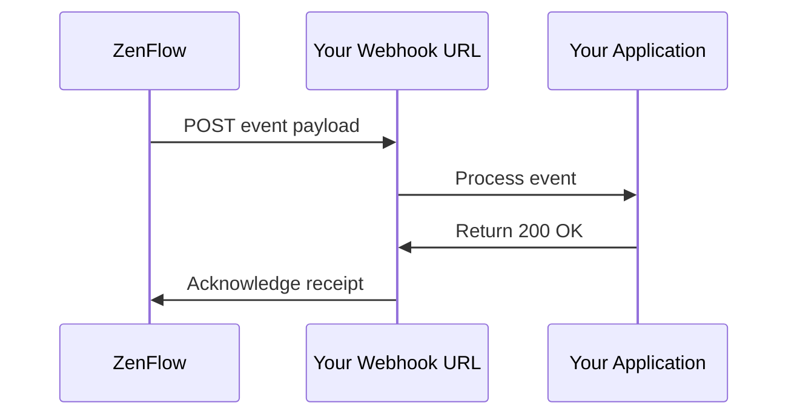

# Webhooks

Webhooks allow your application to receive real-time HTTP notifications when events occur in ZenFlow. Instead of polling the API, webhooks push data to your server as soon as something happens.

## How Webhooks Work



1. An event occurs in ZenFlow (e.g., order created)
2. ZenFlow sends an HTTP POST to your webhook URL
3. Your server processes the event
4. Your server responds with 2xx status code
5. If delivery fails, ZenFlow retries with exponential backoff

## Available Events

### Order Events

| Event             | Description                 |
| ----------------- | --------------------------- |
| `order.created`   | New order created           |
| `order.updated`   | Order details changed       |
| `order.cancelled` | Order was cancelled         |
| `order.completed` | Order fulfillment completed |

### Product Events

| Event             | Description             |
| ----------------- | ----------------------- |
| `product.created` | New product added       |
| `product.updated` | Product details changed |
| `product.deleted` | Product was deleted     |

### Stock Events

| Event                    | Description                   |
| ------------------------ | ----------------------------- |
| `stock.updated`          | Stock level changed           |
| `stock.low_alert`        | Stock below minimum threshold |
| `stock.movement_created` | Stock movement recorded       |

### Flow Events

| Event            | Description            |
| ---------------- | ---------------------- |
| `flow.started`   | Picking flow started   |
| `flow.completed` | Picking flow completed |
| `flow.cancelled` | Picking flow cancelled |

## Creating a Webhook

<CodeGroup>

```bash cURL
curl -X POST "https://api.zenflow.com.ar/api/v1/webhooks" \
  -H "X-API-Key: zenflow_live_your_key" \
  -H "Content-Type: application/json" \
  -d '{
    "name": "Order Notifications",
    "url": "https://your-server.com/webhooks/zenflow",
    "events": ["order.created", "order.updated", "order.completed"]
  }'
```

```javascript Node.js
const response = await fetch("https://api.zenflow.com.ar/api/v1/webhooks", {
  method: "POST",
  headers: {
    "X-API-Key": "zenflow_live_your_key",
    "Content-Type": "application/json",
  },
  body: JSON.stringify({
    name: "Order Notifications",
    url: "https://your-server.com/webhooks/zenflow",
    events: ["order.created", "order.updated", "order.completed"],
  }),
});

const data = await response.json();
console.log("Webhook secret:", data.data.secret);
```

</CodeGroup>

<Warning>
  Save the webhook secret returned in the response. You'll need it to verify
  webhook signatures. It won't be shown again.
</Warning>

## Webhook Payload

All webhook payloads follow this structure:

```json
{
  "id": "evt_abc123",
  "event": "order.created",
  "created_at": "2024-01-15T10:30:00Z",
  "data": {
    // Event-specific data
  }
}
```

### Example: Order Created

```json
{
  "id": "evt_abc123",
  "event": "order.created",
  "created_at": "2024-01-15T10:30:00Z",
  "data": {
    "order_id": 12345,
    "order_tenant_id": "ORD-001",
    "state_id": 1,
    "state_name": "Pending",
    "warehouse_id": 1,
    "items_count": 5,
    "created_at": "2024-01-15T10:30:00Z"
  }
}
```

### Example: Stock Updated

```json
{
  "id": "evt_def456",
  "event": "stock.updated",
  "created_at": "2024-01-15T10:30:00Z",
  "data": {
    "product_id": 100,
    "product_name": "Widget A",
    "product_barcode": "7891234567890",
    "location_id": "LOC-A1",
    "warehouse_id": 1,
    "quantity": 50,
    "previous_quantity": 75
  }
}
```

## Verifying Webhooks

Always verify webhook signatures to ensure requests come from ZenFlow.

### Signature Format

ZenFlow includes a signature in the `X-Webhook-Signature` header:

```
t=1705312200,v1=5d4b8c7a...
```

- `t`: Unix timestamp when the webhook was sent
- `v1`: HMAC-SHA256 signature

### Verification Process

<CodeGroup>

```javascript Node.js
const crypto = require("crypto");

function verifyWebhookSignature(payload, signature, secret) {
  const parts = signature.split(",");
  const timestamp = parts.find((p) => p.startsWith("t=")).substring(2);
  const expectedSig = parts.find((p) => p.startsWith("v1=")).substring(3);

  // Check timestamp is within 5 minutes
  const now = Math.floor(Date.now() / 1000);
  if (Math.abs(now - parseInt(timestamp)) > 300) {
    return false; // Replay attack
  }

  // Compute signature
  const signedPayload = `${timestamp}.${payload}`;
  const computedSig = crypto
    .createHmac("sha256", secret)
    .update(signedPayload)
    .digest("hex");

  // Constant-time comparison
  return crypto.timingSafeEqual(
    Buffer.from(expectedSig),
    Buffer.from(computedSig)
  );
}

// Express.js example
app.post(
  "/webhooks/zenflow",
  express.raw({ type: "application/json" }),
  (req, res) => {
    const signature = req.headers["x-webhook-signature"];
    const payload = req.body.toString();

    if (
      !verifyWebhookSignature(payload, signature, process.env.WEBHOOK_SECRET)
    ) {
      return res.status(401).send("Invalid signature");
    }

    const event = JSON.parse(payload);
    // Process event...

    res.status(200).send("OK");
  }
);
```

```python Python
import hmac
import hashlib
import time
from flask import Flask, request

def verify_webhook_signature(payload, signature, secret):
    parts = dict(p.split('=') for p in signature.split(','))
    timestamp = parts.get('t')
    expected_sig = parts.get('v1')

    # Check timestamp (5 minute tolerance)
    if abs(time.time() - int(timestamp)) > 300:
        return False

    # Compute signature
    signed_payload = f"{timestamp}.{payload}"
    computed_sig = hmac.new(
        secret.encode(),
        signed_payload.encode(),
        hashlib.sha256
    ).hexdigest()

    return hmac.compare_digest(expected_sig, computed_sig)

app = Flask(__name__)

@app.route('/webhooks/zenflow', methods=['POST'])
def handle_webhook():
    signature = request.headers.get('X-Webhook-Signature')
    payload = request.get_data(as_text=True)

    if not verify_webhook_signature(payload, signature, WEBHOOK_SECRET):
        return 'Invalid signature', 401

    event = request.get_json()
    # Process event...

    return 'OK', 200
```

</CodeGroup>

## Retry Policy

If webhook delivery fails, ZenFlow retries with exponential backoff:

| Attempt   | Delay     |
| --------- | --------- |
| 1         | Immediate |
| 2         | 1 second  |
| 3         | 2 seconds |
| 4 (final) | 4 seconds |

A delivery is considered failed if:

- Your server returns a non-2xx status code
- Connection times out (30 seconds default)
- SSL/TLS errors occur

## Best Practices

<CardGroup cols={2}>
  <Card title="Respond Quickly" icon="bolt">
    Return 200 immediately, process async
  </Card>
  <Card title="Handle Duplicates" icon="copy">
    Use event ID for idempotency
  </Card>
  <Card title="Verify Signatures" icon="shield">
    Always validate webhook signatures
  </Card>
  <Card title="Use HTTPS" icon="lock">
    Only use HTTPS webhook URLs
  </Card>
</CardGroup>

### Async Processing

```javascript
app.post("/webhooks/zenflow", (req, res) => {
  // Respond immediately
  res.status(200).send("OK");

  // Process in background
  processWebhookAsync(req.body).catch(console.error);
});

async function processWebhookAsync(event) {
  // Check for duplicate
  if (await isProcessed(event.id)) {
    return;
  }

  // Process event
  switch (event.event) {
    case "order.created":
      await handleOrderCreated(event.data);
      break;
    // ... other events
  }

  // Mark as processed
  await markProcessed(event.id);
}
```

## Managing Webhooks

### View Delivery History

```bash
GET /api/v1/webhooks/:id/deliveries
```

### Test Your Webhook

```bash
POST /api/v1/webhooks/:id/test
```

This sends a test event to verify your endpoint is working.

### Rotate Secret

If your webhook secret is compromised:

```bash
POST /api/v1/webhooks/:id/rotate-secret
```

Update your server with the new secret before the old one expires.
