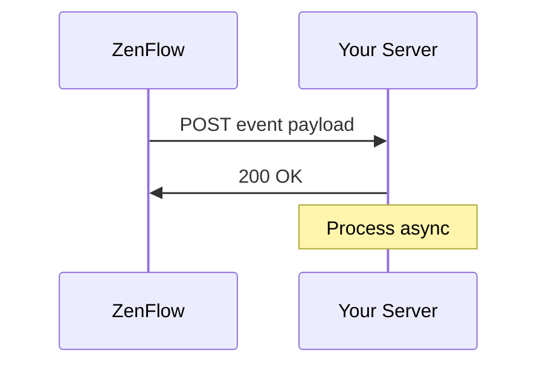

# Webhooks

Webhooks allow your application to receive real-time HTTP notifications when events occur in ZenFlow. Instead of polling the API, webhooks push data to your server as soon as something happens.

## How It Works



1. Subscribe to one or more **topics** (events)
2. When an event occurs, ZenFlow sends a POST to your URL
3. Your server responds with `2xx` to acknowledge receipt
4. If delivery fails, ZenFlow retries with exponential backoff

## Subscribe to Webhooks

To receive notifications, create a webhook specifying your URL and the events you're interested in:

```bash
POST /api/v1/webhooks
```

```json
{
  "name": "My notifications",
  "url": "https://your-server.com/webhooks/zenflow",
  "events": ["order/created", "order/updated", "stock/updated"]
}
```

<Warning>
  Save the `secret` returned in the response. You'll need it to verify signatures. It won't be shown again.
</Warning>

---

## Available Topics

### Orders

<Accordion title="order/created">
Triggered when a new order is created in ZenFlow.

**Payload:**
```json
{
  "id": "evt_abc123",
  "event": "order/created",
  "created_at": "2024-01-15T10:30:00Z",
  "data": {
    "order_id": 12345,
    "order_tenant_id": "ORD-001",
    "state_id": 1,
    "state_name": "Pending",
    "warehouse_id": 1,
    "warehouse_name": "Main Warehouse",
    "items_count": 5,
    "total_quantity": 12,
    "source": "api",
    "source_integration": null,
    "created_at": "2024-01-15T10:30:00Z"
  }
}
```

| Field | Type | Description |
|-------|------|-------------|
| `order_id` | integer | Internal order ID |
| `order_tenant_id` | string | Order ID in your system |
| `state_id` | integer | Current state ID |
| `state_name` | string | State name |
| `warehouse_id` | integer | Assigned warehouse ID |
| `items_count` | integer | Number of line items |
| `total_quantity` | integer | Total units |
| `source` | string | Origin: `api`, `integration`, `manual` |
| `source_integration` | string | Source integration (if applicable) |
</Accordion>

<Accordion title="order/updated">
Triggered when order details are modified (state, items, etc).

**Payload:**
```json
{
  "id": "evt_def456",
  "event": "order/updated",
  "created_at": "2024-01-15T11:00:00Z",
  "data": {
    "order_id": 12345,
    "order_tenant_id": "ORD-001",
    "state_id": 3,
    "state_name": "In Progress",
    "previous_state_id": 1,
    "previous_state_name": "Pending",
    "warehouse_id": 1,
    "updated_fields": ["state_id"],
    "updated_at": "2024-01-15T11:00:00Z"
  }
}
```

| Field | Type | Description |
|-------|------|-------------|
| `previous_state_id` | integer | Previous state |
| `previous_state_name` | string | Previous state name |
| `updated_fields` | array | Fields that were modified |
</Accordion>

<Accordion title="order/cancelled">
Triggered when an order is cancelled.

**Payload:**
```json
{
  "id": "evt_ghi789",
  "event": "order/cancelled",
  "created_at": "2024-01-15T12:00:00Z",
  "data": {
    "order_id": 12345,
    "order_tenant_id": "ORD-001",
    "state_id": 7,
    "state_name": "Cancelled",
    "previous_state_id": 1,
    "previous_state_name": "Pending",
    "cancellation_reason": "Customer requested cancellation",
    "cancelled_by": "user@company.com",
    "cancelled_at": "2024-01-15T12:00:00Z"
  }
}
```

| Field | Type | Description |
|-------|------|-------------|
| `cancellation_reason` | string | Cancellation reason |
| `cancelled_by` | string | User who cancelled |
</Accordion>

<Accordion title="order/completed">
Triggered when an order completes fulfillment (picked and ready for shipping).

**Payload:**
```json
{
  "id": "evt_jkl012",
  "event": "order/completed",
  "created_at": "2024-01-15T14:00:00Z",
  "data": {
    "order_id": 12345,
    "order_tenant_id": "ORD-001",
    "state_id": 5,
    "state_name": "Completed",
    "warehouse_id": 1,
    "items_picked": 5,
    "total_quantity_picked": 12,
    "picked_by": "operator@company.com",
    "started_at": "2024-01-15T13:00:00Z",
    "completed_at": "2024-01-15T14:00:00Z",
    "duration_minutes": 60
  }
}
```

| Field | Type | Description |
|-------|------|-------------|
| `items_picked` | integer | Lines picked |
| `total_quantity_picked` | integer | Total units picked |
| `picked_by` | string | Operator who picked |
| `duration_minutes` | integer | Picking time |
</Accordion>

---

### Products

<Accordion title="product/created">
Triggered when a new product is created.

**Payload:**
```json
{
  "id": "evt_mno345",
  "event": "product/created",
  "created_at": "2024-01-15T10:30:00Z",
  "data": {
    "product_id": 100,
    "sku": "PROD-001",
    "barcode": "7891234567890",
    "name": "Widget A",
    "description": "Product description",
    "category": "Electronics",
    "price": 1500.00,
    "cost": 800.00,
    "weight": 0.5,
    "created_at": "2024-01-15T10:30:00Z"
  }
}
```
</Accordion>

<Accordion title="product/updated">
Triggered when product details are modified.

**Payload:**
```json
{
  "id": "evt_pqr678",
  "event": "product/updated",
  "created_at": "2024-01-15T11:00:00Z",
  "data": {
    "product_id": 100,
    "sku": "PROD-001",
    "barcode": "7891234567890",
    "name": "Widget A - Updated",
    "updated_fields": ["name", "price"],
    "updated_at": "2024-01-15T11:00:00Z"
  }
}
```
</Accordion>

<Accordion title="product/deleted">
Triggered when a product is deleted.

**Payload:**
```json
{
  "id": "evt_stu901",
  "event": "product/deleted",
  "created_at": "2024-01-15T12:00:00Z",
  "data": {
    "product_id": 100,
    "sku": "PROD-001",
    "barcode": "7891234567890",
    "name": "Widget A",
    "deleted_at": "2024-01-15T12:00:00Z"
  }
}
```
</Accordion>

---

### Stock

<Accordion title="stock/updated">
Triggered when a product's stock level changes at a location.

**Payload:**
```json
{
  "id": "evt_vwx234",
  "event": "stock/updated",
  "created_at": "2024-01-15T10:30:00Z",
  "data": {
    "product_id": 100,
    "sku": "PROD-001",
    "barcode": "7891234567890",
    "product_name": "Widget A",
    "warehouse_id": 1,
    "warehouse_name": "Main Warehouse",
    "location_id": "A-01-01",
    "quantity": 50,
    "previous_quantity": 75,
    "change": -25,
    "reason": "order_fulfillment",
    "reference_id": "ORD-001"
  }
}
```

| Field | Type | Description |
|-------|------|-------------|
| `quantity` | integer | New quantity |
| `previous_quantity` | integer | Previous quantity |
| `change` | integer | Difference (+ or -) |
| `reason` | string | Reason for change |
| `reference_id` | string | Reference ID (order, adjustment, etc) |

**`reason` values:**
- `order_fulfillment` - Order picking
- `manual_adjustment` - Manual adjustment
- `stock_receipt` - Goods receipt
- `transfer` - Location transfer
- `return` - Return
- `inventory_count` - Inventory count
</Accordion>

<Accordion title="stock/low_alert">
Triggered when a product's stock falls below the configured minimum threshold.

**Payload:**
```json
{
  "id": "evt_yz0567",
  "event": "stock/low_alert",
  "created_at": "2024-01-15T10:30:00Z",
  "data": {
    "product_id": 100,
    "sku": "PROD-001",
    "barcode": "7891234567890",
    "product_name": "Widget A",
    "warehouse_id": 1,
    "warehouse_name": "Main Warehouse",
    "current_quantity": 5,
    "minimum_threshold": 10,
    "suggested_reorder": 50
  }
}
```

| Field | Type | Description |
|-------|------|-------------|
| `current_quantity` | integer | Current stock |
| `minimum_threshold` | integer | Configured minimum threshold |
| `suggested_reorder` | integer | Suggested reorder quantity |
</Accordion>

<Accordion title="stock/movement_created">
Triggered when a stock movement is recorded (receipt, dispatch, transfer).

**Payload:**
```json
{
  "id": "evt_abc890",
  "event": "stock/movement_created",
  "created_at": "2024-01-15T10:30:00Z",
  "data": {
    "movement_id": 5678,
    "type": "transfer",
    "product_id": 100,
    "sku": "PROD-001",
    "product_name": "Widget A",
    "quantity": 20,
    "from_location": "A-01-01",
    "to_location": "B-02-03",
    "warehouse_id": 1,
    "created_by": "operator@company.com",
    "notes": "Relocation for space",
    "created_at": "2024-01-15T10:30:00Z"
  }
}
```

| Field | Type | Description |
|-------|------|-------------|
| `type` | string | Type: `receipt`, `dispatch`, `transfer`, `adjustment` |
| `from_location` | string | Source location (null if receipt) |
| `to_location` | string | Destination location (null if dispatch) |
</Accordion>

---

### Picking Flows

<Accordion title="flow/started">
Triggered when an operator starts a picking flow.

**Payload:**
```json
{
  "id": "evt_def123",
  "event": "flow/started",
  "created_at": "2024-01-15T13:00:00Z",
  "data": {
    "flow_id": 789,
    "order_id": 12345,
    "order_tenant_id": "ORD-001",
    "warehouse_id": 1,
    "operator_id": 5,
    "operator_email": "operator@company.com",
    "items_to_pick": 5,
    "total_quantity": 12,
    "started_at": "2024-01-15T13:00:00Z"
  }
}
```
</Accordion>

<Accordion title="flow/completed">
Triggered when a picking flow completes successfully.

**Payload:**
```json
{
  "id": "evt_ghi456",
  "event": "flow/completed",
  "created_at": "2024-01-15T14:00:00Z",
  "data": {
    "flow_id": 789,
    "order_id": 12345,
    "order_tenant_id": "ORD-001",
    "warehouse_id": 1,
    "operator_id": 5,
    "operator_email": "operator@company.com",
    "items_picked": 5,
    "total_quantity_picked": 12,
    "started_at": "2024-01-15T13:00:00Z",
    "completed_at": "2024-01-15T14:00:00Z",
    "duration_minutes": 60
  }
}
```
</Accordion>

<Accordion title="flow/cancelled">
Triggered when a picking flow is cancelled.

**Payload:**
```json
{
  "id": "evt_jkl789",
  "event": "flow/cancelled",
  "created_at": "2024-01-15T13:30:00Z",
  "data": {
    "flow_id": 789,
    "order_id": 12345,
    "order_tenant_id": "ORD-001",
    "warehouse_id": 1,
    "operator_id": 5,
    "operator_email": "operator@company.com",
    "cancellation_reason": "Product not available",
    "items_picked_before_cancel": 2,
    "started_at": "2024-01-15T13:00:00Z",
    "cancelled_at": "2024-01-15T13:30:00Z"
  }
}
```
</Accordion>

---

## Payload Structure

All payloads follow this base structure:

```json
{
  "id": "evt_abc123",
  "event": "order/created",
  "created_at": "2024-01-15T10:30:00Z",
  "data": {
    // Event-specific data
  }
}
```

| Field | Type | Description |
|-------|------|-------------|
| `id` | string | Unique event ID (use for idempotency) |
| `event` | string | Event topic |
| `created_at` | string | ISO 8601 timestamp |
| `data` | object | Event-specific payload |

## Verifying Webhooks

Always verify webhook signatures to ensure requests come from ZenFlow.

### Signature Format

ZenFlow includes a signature in the `X-Webhook-Signature` header:

```
t=1705312200,v1=5d4b8c7a...
```

- `t`: Unix timestamp when the webhook was sent
- `v1`: HMAC-SHA256 signature

### Verification Process

<CodeGroup>

```javascript Node.js
const crypto = require("crypto");

function verifyWebhookSignature(payload, signature, secret) {
  const parts = signature.split(",");
  const timestamp = parts.find((p) => p.startsWith("t=")).substring(2);
  const expectedSig = parts.find((p) => p.startsWith("v1=")).substring(3);

  // Check timestamp is within 5 minutes
  const now = Math.floor(Date.now() / 1000);
  if (Math.abs(now - parseInt(timestamp)) > 300) {
    return false; // Replay attack
  }

  // Compute signature
  const signedPayload = `${timestamp}.${payload}`;
  const computedSig = crypto
    .createHmac("sha256", secret)
    .update(signedPayload)
    .digest("hex");

  // Constant-time comparison
  return crypto.timingSafeEqual(
    Buffer.from(expectedSig),
    Buffer.from(computedSig)
  );
}

// Express.js example
app.post(
  "/webhooks/zenflow",
  express.raw({ type: "application/json" }),
  (req, res) => {
    const signature = req.headers["x-webhook-signature"];
    const payload = req.body.toString();

    if (
      !verifyWebhookSignature(payload, signature, process.env.WEBHOOK_SECRET)
    ) {
      return res.status(401).send("Invalid signature");
    }

    const event = JSON.parse(payload);
    // Process event...

    res.status(200).send("OK");
  }
);
```

```python Python
import hmac
import hashlib
import time
from flask import Flask, request

def verify_webhook_signature(payload, signature, secret):
    parts = dict(p.split('=') for p in signature.split(','))
    timestamp = parts.get('t')
    expected_sig = parts.get('v1')

    # Check timestamp (5 minute tolerance)
    if abs(time.time() - int(timestamp)) > 300:
        return False

    # Compute signature
    signed_payload = f"{timestamp}.{payload}"
    computed_sig = hmac.new(
        secret.encode(),
        signed_payload.encode(),
        hashlib.sha256
    ).hexdigest()

    return hmac.compare_digest(expected_sig, computed_sig)

app = Flask(__name__)

@app.route('/webhooks/zenflow', methods=['POST'])
def handle_webhook():
    signature = request.headers.get('X-Webhook-Signature')
    payload = request.get_data(as_text=True)

    if not verify_webhook_signature(payload, signature, WEBHOOK_SECRET):
        return 'Invalid signature', 401

    event = request.get_json()
    # Process event...

    return 'OK', 200
```

</CodeGroup>

## Retry Policy

If webhook delivery fails, ZenFlow retries with exponential backoff:

| Attempt   | Delay     |
| --------- | --------- |
| 1         | Immediate |
| 2         | 1 second  |
| 3         | 2 seconds |
| 4 (final) | 4 seconds |

A delivery is considered failed if:

- Your server returns a non-2xx status code
- Connection times out (30 seconds default)
- SSL/TLS errors occur

## Best Practices

<CardGroup cols={2}>
  <Card title="Respond Quickly" icon="bolt">
    Return 200 immediately, process async
  </Card>
  <Card title="Handle Duplicates" icon="copy">
    Use event ID for idempotency
  </Card>
  <Card title="Verify Signatures" icon="shield">
    Always validate webhook signatures
  </Card>
  <Card title="Use HTTPS" icon="lock">
    Only use HTTPS webhook URLs
  </Card>
</CardGroup>

### Async Processing

```javascript
app.post("/webhooks/zenflow", (req, res) => {
  // Respond immediately
  res.status(200).send("OK");

  // Process in background
  processWebhookAsync(req.body).catch(console.error);
});

async function processWebhookAsync(event) {
  // Check for duplicate
  if (await isProcessed(event.id)) {
    return;
  }

  // Process event
  switch (event.event) {
    case "order/created":
      await handleOrderCreated(event.data);
      break;
    // ... other events
  }

  // Mark as processed
  await markProcessed(event.id);
}
```

## Managing Webhooks

### View Delivery History

```bash
GET /api/v1/webhooks/:id/deliveries
```

### Test Your Webhook

```bash
POST /api/v1/webhooks/:id/test
```

This sends a test event to verify your endpoint is working.

### Rotate Secret

If your webhook secret is compromised:

```bash
POST /api/v1/webhooks/:id/rotate-secret
```

Update your server with the new secret before the old one expires.
