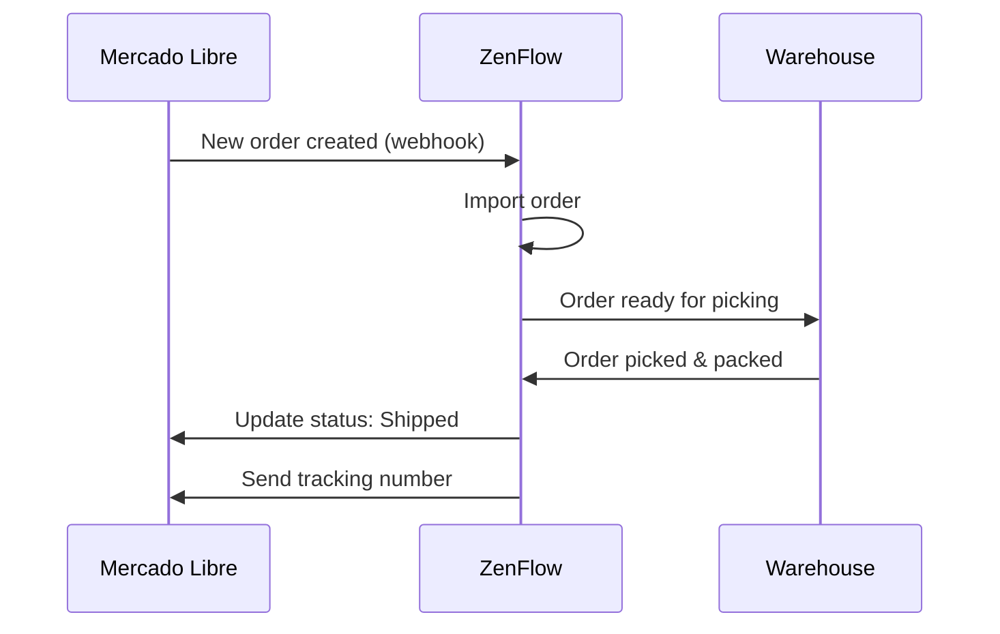

# Mercado Libre Integration

Connect your Mercado Libre seller account with ZenFlow to automatically import orders, sync inventory, and update order statuses.

<Note>
  This integration supports Mercado Libre accounts in Argentina, Brazil, Mexico, Colombia, Chile, Uruguay, and Peru. **Includes support for MercadoShops** as an additional channel.
</Note>

## Supported Channels

This integration includes support for:

- **Mercado Libre** - Main marketplace
- **MercadoShops** - Your own online store within the Mercado Libre ecosystem

Both channels are managed from the same integration. MercadoShops orders are automatically imported alongside Mercado Libre orders.

## Features

<CardGroup cols={2}>
  <Card title="Order Import" icon="download">
    Import orders from Mercado Libre and MercadoShops
  </Card>
  <Card title="Status Updates" icon="rotate">
    Push fulfillment status back to Mercado Libre
  </Card>
  <Card title="Inventory Sync" icon="warehouse">
    Keep stock levels synchronized in real-time
  </Card>
  <Card title="Multi-account" icon="users">
    Connect multiple Mercado Libre accounts
  </Card>
</CardGroup>

## Setup Guide

### Step 1: Connect Your Account

1. Go to **Settings** > **Integrations** in ZenFlow
2. Click **Connect Mercado Libre**
3. Log in with your Mercado Libre seller account
4. Authorize ZenFlow to access your account

<Warning>
  Make sure you're logged in with a seller account that has active listings. Buyer-only accounts cannot be integrated.
</Warning>

### Step 2: Configure Sync Settings

After connecting, configure your sync preferences:

```
Order Settings:
- Import orders automatically: Yes
- Order status to import: All / Paid only
- Assign to warehouse: [Select warehouse]

Inventory Settings:
- Sync inventory: Yes
- Sync frequency: Real-time / Every 15 min / Hourly
- Stock buffer: 0 (optional safety stock to hold back)
```

### Step 3: Map Products (Optional)

If your products have different SKUs in Mercado Libre vs ZenFlow, set up product mapping:

| Mercado Libre SKU | ZenFlow SKU |
|-------------------|-------------|
| MLB-12345 | PROD-001 |
| MLB-67890 | PROD-002 |

## Order Flow



## API Reference

### Get Connected Accounts

```bash
GET /api/v1/integrations/mercadolibre/accounts
```

Response:
```json
{
  "success": true,
  "data": {
    "accounts": [
      {
        "id": "123456789",
        "nickname": "MYSTORE",
        "site_id": "MLA",
        "connected_at": "2024-01-15T10:30:00Z",
        "status": "active"
      }
    ]
  }
}
```

### Sync Orders Manually

```bash
POST /api/v1/integrations/mercadolibre/sync/orders
```

Request:
```json
{
  "account_id": "123456789",
  "date_from": "2024-01-01",
  "date_to": "2024-01-15"
}
```

### Update Inventory

```bash
POST /api/v1/integrations/mercadolibre/inventory/sync
```

Request:
```json
{
  "account_id": "123456789",
  "items": [
    {
      "item_id": "MLA1234567890",
      "available_quantity": 50
    }
  ]
}
```

## Webhooks

ZenFlow automatically listens for these Mercado Libre events:

| Event | Description |
|-------|-------------|
| `orders_v2` | New order created or order updated |
| `shipments` | Shipment status changed |
| `items` | Product listing updated |
| `questions` | New question received (optional) |

## Troubleshooting

### Orders Not Importing

<Accordion title="Check connection status">
  Go to **Settings** > **Integrations** and verify your Mercado Libre account shows as "Connected". If disconnected, re-authorize the connection.
</Accordion>

<Accordion title="Verify webhook configuration">
  Mercado Libre webhooks should be automatically configured. If orders are missing, try manually syncing orders for the affected date range.
</Accordion>

### Inventory Not Updating

<Accordion title="Check product mapping">
  Ensure your products are correctly mapped between ZenFlow and Mercado Libre SKUs.
</Accordion>

<Accordion title="Verify sync settings">
  Check that inventory sync is enabled in your integration settings.
</Accordion>

## Rate Limits

Mercado Libre enforces API rate limits:

| Endpoint Type | Limit |
|---------------|-------|
| Orders | 10,000 requests/hour |
| Items | 10,000 requests/hour |
| Inventory | 3,000 requests/hour |

ZenFlow automatically handles rate limiting and retries.

## Support

- [Mercado Libre Developer Documentation](https://developers.mercadolibre.com)
- Contact [support@zenflow.com](mailto:support@zenflow.com) for integration help
