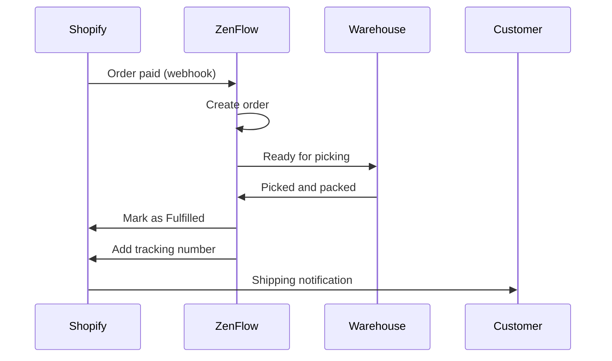

# Shopify Integration

Connect your Shopify store with ZenFlow to automatically import orders, sync inventory, and streamline your fulfillment operations.

<Note>
  This integration supports Shopify stores from any country. Compatible with Shopify and Shopify Plus.
</Note>

## Features

<CardGroup cols={2}>
  <Card title="Import Orders" icon="download">
    Automatically import paid orders from Shopify
  </Card>
  <Card title="Update Status" icon="rotate">
    Mark orders as fulfilled and send tracking info
  </Card>
  <Card title="Inventory Sync" icon="warehouse">
    Real-time stock synchronization to Shopify
  </Card>
  <Card title="Product Mapping" icon="barcode">
    Link Shopify products with your ZenFlow catalog
  </Card>
</CardGroup>

## Setup Guide

### Step 1: Connect Your Store

1. Go to **Settings** > **Integrations** in ZenFlow
2. Click **Connect Shopify**
3. Enter your store domain (e.g., `mystore.myshopify.com`)
4. You'll be redirected to Shopify to authorize the app
5. Accept the requested permissions

<Note>
  ZenFlow requests permissions to read/write orders, products, and inventory. These are necessary for bidirectional sync.
</Note>

### Step 2: Configure Sync Settings

After connecting, set your preferences:

```
Order Settings:
- Sync orders: Yes/No
- Import only paid: Yes/No
- Default warehouse: [Select]

Inventory Settings:
- Sync stock: Yes/No
- Direction: ZenFlow -> Shopify
```

### Step 3: Map Products

Link your Shopify products with ZenFlow:

1. Go to **Integrations** > **Shopify** > **Product Mapping**
2. ZenFlow will attempt to auto-match by SKU
3. For unmatched products, manually select the ZenFlow product

## Order Flow



## API Reference

### Start Authorization

```bash
POST /api/v1/integrations/shopify/auth/start
```

Request:
```json
{
  "shop_domain": "mystore.myshopify.com",
  "warehouse_id": 1
}
```

Response:
```json
{
  "success": true,
  "data": {
    "authorization_url": "https://mystore.myshopify.com/admin/oauth/authorize?..."
  }
}
```

### Get Connection Status

```bash
GET /api/v1/integrations/shopify/status
```

Response:
```json
{
  "success": true,
  "data": {
    "connected": true,
    "shop_domain": "mystore.myshopify.com",
    "shop_name": "My Store",
    "status": "active",
    "sync_orders": true,
    "sync_stock": true,
    "last_sync_at": "2024-01-20T15:45:00Z"
  }
}
```

### Update Configuration

```bash
PUT /api/v1/integrations/shopify/config
```

Request:
```json
{
  "sync_orders": true,
  "sync_stock": true
}
```

### Manually Sync Orders

```bash
POST /api/v1/integrations/shopify/sync/orders
```

Request:
```json
{
  "date_from": "2024-01-01",
  "date_to": "2024-01-31"
}
```

### Sync Stock to Shopify

```bash
POST /api/v1/integrations/shopify/sync/stock
```

Syncs all inventory levels for mapped products to Shopify.

### List Product Mappings

```bash
GET /api/v1/integrations/shopify/mappings
```

Response:
```json
{
  "success": true,
  "data": {
    "mappings": [
      {
        "id": 1,
        "product_id": 100,
        "product_sku": "PROD-001",
        "shopify_product_id": "7654321098765",
        "shopify_variant_id": "43210987654321",
        "shopify_sku": "PROD-001",
        "sync_stock": true,
        "last_stock_sync": "2024-01-20T15:45:00Z"
      }
    ]
  }
}
```

### Create Product Mapping

```bash
POST /api/v1/integrations/shopify/mappings
```

Request:
```json
{
  "product_id": 100,
  "shopify_product_id": "7654321098765",
  "shopify_variant_id": "43210987654321",
  "sync_stock": true
}
```

### Delete Mapping

```bash
DELETE /api/v1/integrations/shopify/mappings/:id
```

### Disconnect Store

```bash
DELETE /api/v1/integrations/shopify/disconnect
```

## Webhook Events

ZenFlow automatically receives these webhooks from Shopify:

| Topic | Description | ZenFlow Action |
|-------|-------------|----------------|
| `orders/create` | New order created | Imports order if paid |
| `orders/paid` | Payment confirmed | Imports order for fulfillment |
| `orders/updated` | Order updated | Records changes |
| `orders/cancelled` | Order cancelled | Cancels order in ZenFlow |
| `orders/fulfilled` | Order fulfilled | Records fulfillment |
| `products/create` | Product created | Records for mapping |
| `products/update` | Product updated | Updates mapping info |
| `products/delete` | Product deleted | Removes mapping |
| `inventory_levels/update` | Stock updated | Records change (if bidirectional) |
| `app/uninstalled` | App uninstalled | Revokes credentials |

## Product Mapping

### Automatic Matching

ZenFlow attempts to match products automatically using:

1. **SKU** (exact match)
2. **Barcode** (if configured in Shopify)

### Manual Mapping

For products that don't auto-match:

1. Go to **Integrations** > **Shopify** > **Product Mapping**
2. Filter by "Unmapped"
3. Select the corresponding ZenFlow product

### Multi-Variant Products

Each Shopify variant maps to a separate product in ZenFlow:

| Shopify | ZenFlow |
|---------|---------|
| Blue Shirt (S) | SHIRT-BLUE-S |
| Blue Shirt (M) | SHIRT-BLUE-M |
| Blue Shirt (L) | SHIRT-BLUE-L |
| Red Shirt (S) | SHIRT-RED-S |

## Status Mapping

| Shopify Status | ZenFlow Status |
|----------------|----------------|
| `unfulfilled` | Ready to pick |
| `partial` | In progress |
| `fulfilled` | Shipped |
| `restocked` | Cancelled |

## Troubleshooting

### Orders Not Importing

<Accordion title="Check sync configuration">
  Make sure `sync_orders` is enabled in the configuration. Go to **Integrations** > **Shopify** > **Settings**.
</Accordion>

<Accordion title="Check order status">
  By default, only orders with `paid` status are imported. Verify the order has confirmed payment in Shopify.
</Accordion>

<Accordion title="Check webhooks">
  Webhooks are registered automatically. If there are issues, disconnect and reconnect the integration.
</Accordion>

### Stock Not Syncing

<Accordion title="Check product mapping">
  The product must be properly mapped. Verify a mapping exists in **Product Mapping**.
</Accordion>

<Accordion title="Check sync flag">
  Each mapping has a `sync_stock` flag. Make sure it's enabled for products you want to sync.
</Accordion>

<Accordion title="Check Shopify locations">
  ZenFlow syncs with the primary Shopify location. If you have multiple locations, verify which one is set as primary.
</Accordion>

### Authorization Error

<Accordion title="Insufficient permissions">
  If authorization fails, verify you accepted all requested permissions. Try disconnecting and reconnecting.
</Accordion>

<Accordion title="Expired token">
  Shopify tokens are long-lived. If expired, disconnect and reconnect the integration.
</Accordion>

## Rate Limits

| Operation | Limit |
|-----------|-------|
| API calls | 2 requests/second |
| Token bucket | 40 tokens |

ZenFlow handles rate limits automatically with exponential backoff and respects Shopify's "leaky bucket" algorithm.

## Required Scopes

The integration requests the following permissions:

- `read_orders`, `write_orders` - Read and update orders
- `read_products`, `write_products` - Read and update products
- `read_inventory`, `write_inventory` - Manage stock levels
- `read_locations` - Read inventory locations
- `read_fulfillments`, `write_fulfillments` - Manage fulfillments

## Support

- [Shopify API Documentation](https://shopify.dev/docs/api)
- Contact [support@zenflow.com](mailto:support@zenflow.com) for integration help
