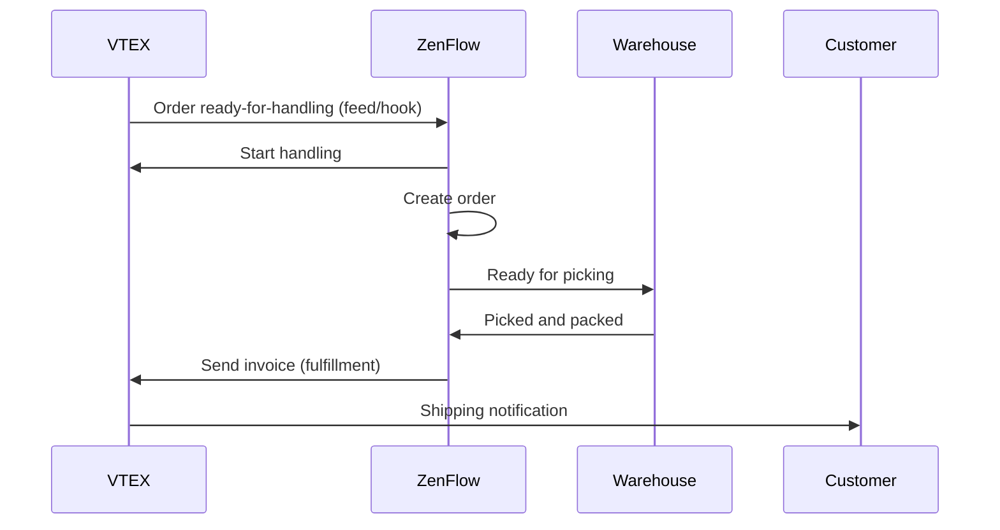

# VTEX Integration

Connect your VTEX store with ZenFlow to automatically import orders, sync inventory, and streamline your fulfillment operations at enterprise scale.

<Note>
  This integration supports VTEX Commerce in any country. Compatible with VTEX's OMS (Order Management System).
</Note>

## Features

<CardGroup cols={2}>
  <Card title="Import Orders" icon="download">
    Import orders in "ready-for-handling" status
  </Card>
  <Card title="Real-time Feed" icon="bolt">
    Receive status changes via Feed or Webhooks
  </Card>
  <Card title="Inventory Sync" icon="warehouse">
    Stock synchronization by warehouse to VTEX
  </Card>
  <Card title="Multi-warehouse" icon="building">
    Support for multiple VTEX warehouses
  </Card>
</CardGroup>

## Setup Guide

### Step 1: Get API Credentials in VTEX

1. In your VTEX admin, go to **Account settings** > **Application keys**
2. Click **Generate new key**
3. Assign the following permissions:
   - OMS - Full access
   - Logistics - Full access
4. Copy the **App Key** and **App Token**

<Warning>
  The App Token is only shown once. Store it securely.
</Warning>

### Step 2: Connect in ZenFlow

1. Go to **Settings** > **Integrations** in ZenFlow
2. Click **Connect VTEX**
3. Enter:
   - **Account Name**: Your VTEX account name (e.g., `mystore`)
   - **App Key**: The application key
   - **App Token**: The application token
4. Click **Connect**

### Step 3: Select VTEX Warehouse

After connecting, select the VTEX warehouse you want to sync:

1. Go to **Integrations** > **VTEX** > **Settings**
2. Select the VTEX warehouse from the list
3. Enable order and/or inventory synchronization

### Step 4: Configure Notifications (Optional)

Choose how to receive new order notifications:

<CardGroup cols={2}>
  <Card title="Feed (Recommended)" icon="list">
    ZenFlow polls VTEX every 30 seconds. More reliable.
  </Card>
  <Card title="Webhooks" icon="bell">
    VTEX notifies ZenFlow in real-time. Faster but may miss events.
  </Card>
</CardGroup>

## Order Flow



## API Reference

### Connect Account

```bash
POST /api/v1/integrations/vtex/connect
```

Request:
```json
{
  "account_name": "mystore",
  "app_key": "vtexappkey-mystore-XXXXXX",
  "app_token": "XXXXXXXXXXXXXXXXXXXXXXXXXXXXXXXX",
  "environment": "vtexcommercestable"
}
```

Response:
```json
{
  "success": true,
  "data": {
    "id": "cred_abc123",
    "account_name": "mystore",
    "status": "active",
    "connected_at": "2024-01-15T10:30:00Z"
  }
}
```

### Get Connection Status

```bash
GET /api/v1/integrations/vtex/status
```

Response:
```json
{
  "success": true,
  "data": {
    "connected": true,
    "account_name": "mystore",
    "status": "active",
    "vtex_warehouse_id": "warehouse_1",
    "feed_configured": true,
    "hook_configured": false,
    "sync_orders": true,
    "sync_stock": true,
    "last_sync_at": "2024-01-20T15:45:00Z"
  }
}
```

### Update Configuration

```bash
PUT /api/v1/integrations/vtex/config
```

Request:
```json
{
  "sync_orders": true,
  "sync_stock": true
}
```

### List VTEX Warehouses

```bash
GET /api/v1/integrations/vtex/warehouses
```

Response:
```json
{
  "success": true,
  "data": {
    "warehouses": [
      {
        "id": "warehouse_1",
        "name": "Main Warehouse",
        "is_active": true
      },
      {
        "id": "warehouse_2",
        "name": "North Branch",
        "is_active": true
      }
    ]
  }
}
```

### Set Warehouse

```bash
POST /api/v1/integrations/vtex/warehouses/set
```

Request:
```json
{
  "vtex_warehouse_id": "warehouse_1"
}
```

### Configure Feed

```bash
POST /api/v1/integrations/vtex/feed/configure
```

Configures the polling feed to receive order changes.

### Configure Webhooks

```bash
POST /api/v1/integrations/vtex/hook/configure
```

Registers webhooks in VTEX for real-time notifications.

### Manually Sync Orders

```bash
POST /api/v1/integrations/vtex/sync/orders
```

Request:
```json
{
  "date_from": "2024-01-01",
  "date_to": "2024-01-31"
}
```

### Sync Stock to VTEX

```bash
POST /api/v1/integrations/vtex/sync/stock
```

### List Product Mappings

```bash
GET /api/v1/integrations/vtex/mappings
```

Response:
```json
{
  "success": true,
  "data": {
    "mappings": [
      {
        "id": "map_abc123",
        "product_id": 100,
        "product_sku": "PROD-001",
        "vtex_sku_id": "123456",
        "vtex_product_id": "789",
        "sync_stock": true,
        "last_stock_sync": "2024-01-20T15:45:00Z"
      }
    ]
  }
}
```

### Create Product Mapping

```bash
POST /api/v1/integrations/vtex/mappings
```

Request:
```json
{
  "product_id": 100,
  "vtex_sku_id": "123456",
  "vtex_product_id": "789",
  "sync_stock": true
}
```

### Delete Mapping

```bash
DELETE /api/v1/integrations/vtex/mappings/:id
```

### Disconnect Account

```bash
POST /api/v1/integrations/vtex/disconnect
```

## Order Notifications

### Feed (Polling)

Feed is the recommended method for receiving notifications:

- ZenFlow polls VTEX every 30 seconds
- Processes status changes in batch
- Confirms processed items to avoid duplicates
- More reliable than webhooks (doesn't miss events)

### Webhooks

Webhooks provide real-time notifications:

| Event | Description | ZenFlow Action |
|-------|-------------|----------------|
| Status changes to `ready-for-handling` | Order ready | Imports and starts handling |
| Status changes to `handling` | In preparation | Updates status |
| Status changes to `invoiced` | Shipped | Marks as completed |
| Status changes to `canceled` | Cancelled | Cancels order |

## Product Mapping

### Automatic Matching

When an order is imported, ZenFlow attempts to match products automatically:

1. Looks for existing mapping by `vtex_sku_id`
2. If not found, searches by **SKU** or **barcode** in ZenFlow
3. If found, creates the mapping automatically

### Manual Mapping

For products that don't auto-match:

1. Go to **Integrations** > **VTEX** > **Product Mapping**
2. Filter by "Unmapped"
3. Select the corresponding ZenFlow product

## Status Mapping

| VTEX Status | ZenFlow Status |
|-------------|----------------|
| `order-created` | Pending |
| `payment-approved` | Ready to pick |
| `ready-for-handling` | Ready to pick |
| `start-handling` | In progress |
| `handling` | In progress |
| `invoice` | Ready for dispatch |
| `invoiced` | Shipped |
| `canceled` | Cancelled |

## Inventory Synchronization

Stock synchronization works as follows:

1. ZenFlow calculates available stock (total - reserved)
2. Updates inventory in VTEX for the configured warehouse
3. Only syncs products with active mapping and `sync_stock: true`

```json
// Update example
PUT /api/logistics/pvt/inventory/skus/{sku}/warehouses/{warehouse}
{
  "quantity": 50,
  "unlimitedQuantity": false
}
```

## Troubleshooting

### Cannot Connect

<Accordion title="Check credentials">
  Make sure the App Key and App Token are correct. Generate new credentials if needed.
</Accordion>

<Accordion title="Check permissions">
  Credentials need full access to OMS and Logistics. Verify permissions in VTEX Admin.
</Accordion>

<Accordion title="Check account name">
  The account_name must be exactly your VTEX account name (without ".vtexcommercestable.com.br").
</Accordion>

### Orders Not Importing

<Accordion title="Check order status">
  Only orders in "ready-for-handling" status are imported. Check the order flow in VTEX.
</Accordion>

<Accordion title="Check configured warehouse">
  Make sure you've selected the correct VTEX warehouse in the configuration.
</Accordion>

<Accordion title="Check feed or webhooks">
  Verify that feed is configured (recommended) or that webhooks are active.
</Accordion>

### Stock Not Syncing

<Accordion title="Check product mapping">
  The product must be mapped and have `sync_stock` enabled.
</Accordion>

<Accordion title="Check VTEX warehouse">
  The VTEX warehouse must be configured in the integration.
</Accordion>

<Accordion title="Check Logistics permissions">
  Credentials need Logistics permissions to update inventory.
</Accordion>

## Rate Limits

| Operation | Limit |
|-----------|-------|
| API calls | 100 requests/second |
| Maximum per minute | 6000 requests |

ZenFlow handles rate limits automatically with wait and retry logic.

## Requirements

- Active VTEX account
- App Key and App Token with permissions:
  - OMS - Full access
  - Logistics - Full access
- At least one warehouse configured in VTEX

## Support

- [VTEX APIs Documentation](https://developers.vtex.com/docs/api-reference)
- [VTEX Help Center](https://help.vtex.com/)
- Contact [support@zenflow.com](mailto:support@zenflow.com) for integration help
