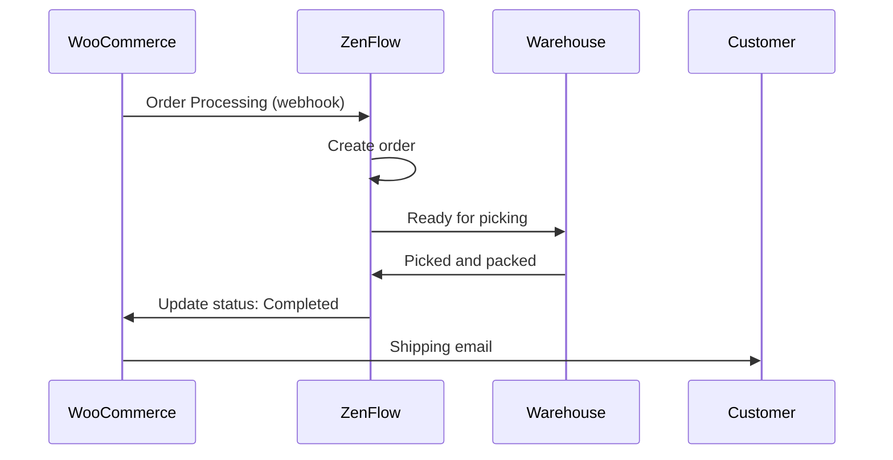

# WooCommerce Integration

Connect your WooCommerce store with ZenFlow to automatically import orders, sync inventory, and streamline your fulfillment operations.

<Note>
  This integration supports WooCommerce 3.5+ with WordPress. Compatible with simple and variable products.
</Note>

## Features

<CardGroup cols={2}>
  <Card title="Import Orders" icon="download">
    Automatically import orders in processing status
  </Card>
  <Card title="Update Status" icon="rotate">
    Bidirectional order status sync
  </Card>
  <Card title="Inventory Sync" icon="warehouse">
    Real-time stock synchronization to WooCommerce
  </Card>
  <Card title="Variable Products" icon="barcode">
    Full support for products with variations
  </Card>
</CardGroup>

## Setup Guide

### Step 1: Generate API Credentials in WooCommerce

1. In your WordPress admin, go to **WooCommerce** > **Settings** > **Advanced** > **REST API**
2. Click **Add key**
3. Configure:
   - **Description**: ZenFlow Integration
   - **User**: Select an administrator
   - **Permissions**: Read/Write
4. Click **Generate API key**
5. **Save** the Consumer Key and Consumer Secret (they won't be shown again)

<Warning>
  Make sure to copy the credentials immediately. WooCommerce only shows them once.
</Warning>

### Step 2: Connect in ZenFlow

1. Go to **Settings** > **Integrations** in ZenFlow
2. Click **Connect WooCommerce**
3. Enter:
   - Your store URL (e.g., `https://mystore.com`)
   - Consumer Key
   - Consumer Secret
4. Click **Connect**

### Step 3: Configure Sync Settings

After connecting, set your preferences:

```
Order Settings:
- Sync orders: Yes/No
- Statuses to import: Processing
- Default warehouse: [Select]

Inventory Settings:
- Sync stock: Yes/No
- Direction: ZenFlow -> WooCommerce
```

## Order Flow



## API Reference

### Connect Store

```bash
POST /api/v1/integrations/woocommerce/connect
```

Request:
```json
{
  "store_url": "https://mystore.com",
  "consumer_key": "ck_xxxxxxxxxxxxxxxxxxxxxxxxxxxxxxxxxxxxxxxx",
  "consumer_secret": "cs_xxxxxxxxxxxxxxxxxxxxxxxxxxxxxxxxxxxxxxxx",
  "warehouse_id": 1
}
```

Response:
```json
{
  "success": true,
  "data": {
    "id": "cred_abc123",
    "store_url": "https://mystore.com",
    "store_name": "My Store",
    "status": "active",
    "connected_at": "2024-01-15T10:30:00Z"
  }
}
```

### Get Connection Status

```bash
GET /api/v1/integrations/woocommerce/status
```

Response:
```json
{
  "success": true,
  "data": {
    "connected": true,
    "store_url": "https://mystore.com",
    "store_name": "My Store",
    "status": "active",
    "sync_orders": true,
    "sync_stock": true,
    "last_sync_at": "2024-01-20T15:45:00Z"
  }
}
```

### Update Configuration

```bash
PUT /api/v1/integrations/woocommerce/config
```

Request:
```json
{
  "sync_orders": true,
  "sync_stock": true
}
```

### Manually Sync Orders

```bash
POST /api/v1/integrations/woocommerce/sync/orders
```

Request:
```json
{
  "date_from": "2024-01-01",
  "date_to": "2024-01-31"
}
```

### Sync Stock to WooCommerce

```bash
POST /api/v1/integrations/woocommerce/sync/stock
```

Syncs all inventory levels for mapped products to WooCommerce.

### List Product Mappings

```bash
GET /api/v1/integrations/woocommerce/mappings
```

Response:
```json
{
  "success": true,
  "data": {
    "mappings": [
      {
        "id": "map_abc123",
        "product_id": 100,
        "product_sku": "PROD-001",
        "wc_product_id": 456,
        "wc_variation_id": null,
        "wc_sku": "PROD-001",
        "sync_stock": true,
        "last_stock_sync": "2024-01-20T15:45:00Z"
      }
    ]
  }
}
```

### Create Product Mapping

```bash
POST /api/v1/integrations/woocommerce/mappings
```

Request:
```json
{
  "product_id": 100,
  "wc_product_id": 456,
  "wc_variation_id": null,
  "sync_stock": true
}
```

### Delete Mapping

```bash
DELETE /api/v1/integrations/woocommerce/mappings/:id
```

### Disconnect Store

```bash
POST /api/v1/integrations/woocommerce/disconnect
```

## Webhook Events

ZenFlow automatically receives these webhooks from WooCommerce:

| Topic | Description | ZenFlow Action |
|-------|-------------|----------------|
| `order.created` | New order created | Imports if status is "processing" |
| `order.updated` | Order updated | Updates status in ZenFlow |
| `order.deleted` | Order deleted | Marks as cancelled |

<Note>
  Webhooks are automatically registered in WooCommerce when you connect your store.
</Note>

## Product Mapping

### Automatic Matching

When an order is imported, ZenFlow attempts to match products automatically:

1. Looks for existing mapping by `wc_product_id` + `wc_variation_id`
2. If not found, searches by **SKU** in ZenFlow catalog
3. If found by SKU, creates the mapping automatically

### Manual Mapping

For products that don't auto-match:

1. Go to **Integrations** > **WooCommerce** > **Product Mapping**
2. Filter by "Unmapped"
3. Select the corresponding ZenFlow product

### Variable Products

Each WooCommerce variation maps to a separate product in ZenFlow:

| WooCommerce | ZenFlow |
|-------------|---------|
| T-Shirt (Size: S, Color: Blue) | TSHIRT-S-BLUE |
| T-Shirt (Size: M, Color: Blue) | TSHIRT-M-BLUE |
| T-Shirt (Size: L, Color: Blue) | TSHIRT-L-BLUE |

## Status Mapping

| WooCommerce Status | ZenFlow Status |
|--------------------|----------------|
| `pending` | Pending |
| `processing` | Ready to pick |
| `on-hold` | Pending |
| `completed` | Completed |
| `cancelled` | Cancelled |
| `refunded` | Cancelled |
| `failed` | Cancelled |

## Troubleshooting

### Cannot Connect

<Accordion title="Check store URL">
  Make sure to use the correct URL including `https://`. The URL must be publicly accessible.
</Accordion>

<Accordion title="Check API credentials">
  Consumer Key and Secret must have Read/Write permissions. Generate new credentials if needed.
</Accordion>

<Accordion title="Check SSL">
  WooCommerce requires HTTPS for the REST API. Make sure your site has a valid SSL certificate.
</Accordion>

### Orders Not Importing

<Accordion title="Check order status">
  By default, only orders with "Processing" status are imported. Orders in "Pending" or "On-hold" are not imported automatically.
</Accordion>

<Accordion title="Check webhooks">
  Go to **WooCommerce** > **Settings** > **Advanced** > **Webhooks** and verify that ZenFlow webhooks are active.
</Accordion>

<Accordion title="Check sync configuration">
  Make sure `sync_orders` is enabled in the integration settings.
</Accordion>

### Stock Not Syncing

<Accordion title="Check product mapping">
  The product must be properly mapped. Verify a mapping exists in **Product Mapping**.
</Accordion>

<Accordion title="Check sync flag">
  Each mapping has a `sync_stock` flag. Make sure it's enabled.
</Accordion>

<Accordion title="Check stock management in WC">
  In WooCommerce, the product must have "Manage stock" enabled for ZenFlow to update quantities.
</Accordion>

## Rate Limits

| Operation | Limit |
|-----------|-------|
| API calls | 5 requests/second |
| Timeout | 30 seconds |

ZenFlow handles rate limits automatically with retries and exponential backoff.

## Requirements

- WooCommerce 3.5 or higher
- WordPress 5.0 or higher
- HTTPS enabled (SSL certificate)
- WooCommerce REST API enabled
- Permalinks configured (not "Plain")

## Support

- [WooCommerce REST API Documentation](https://woocommerce.github.io/woocommerce-rest-api-docs/)
- Contact [support@zenflow.com](mailto:support@zenflow.com) for integration help
