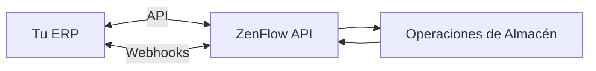
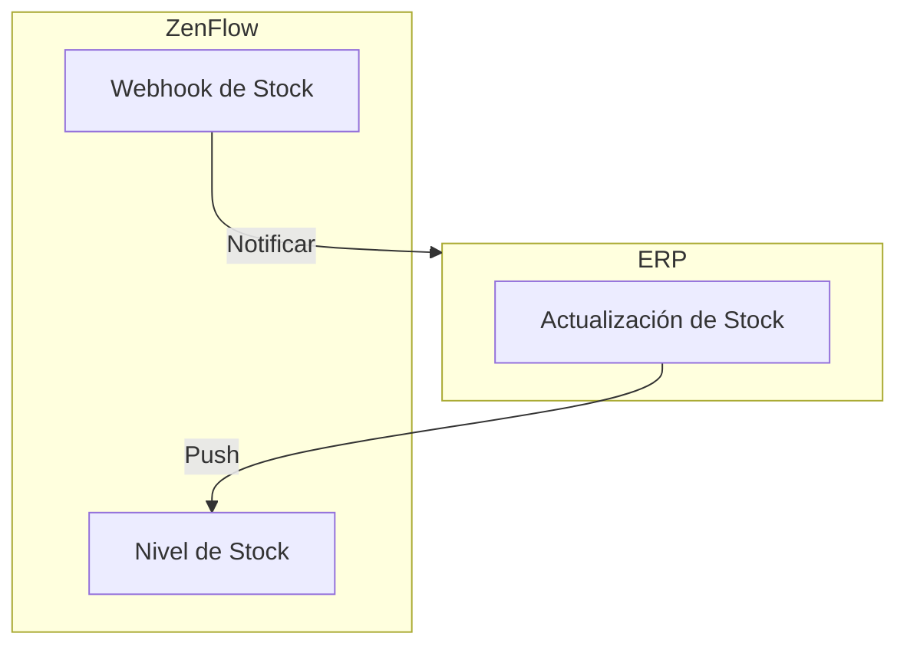

# Guía de Integración ERP

Esta guía cubre las mejores prácticas para integrar ZenFlow con tu sistema de Planificación de Recursos Empresariales (ERP) para una gestión de pedidos e inventario sin interrupciones.

## Arquitectura de Integración



## Puntos Clave de Integración

<CardGroup cols={2}>
  <Card title="Pedidos" icon="box" href="#sincronizacion-de-pedidos">
    Envía pedidos desde el ERP a ZenFlow para fulfillment
  </Card>
  <Card title="Productos" icon="barcode" href="#sincronizacion-de-productos">
    Sincroniza el catálogo de productos entre sistemas
  </Card>
  <Card title="Stock" icon="warehouse" href="#sincronizacion-de-stock">
    Sincronización bidireccional de inventario
  </Card>
  <Card title="Eventos" icon="bell" href="#webhooks">
    Recibe actualizaciones de estado de fulfillment
  </Card>
</CardGroup>

## Sincronización de Pedidos

### Enviando Pedidos a ZenFlow

Cuando se crea un nuevo pedido en tu ERP, envíalo a ZenFlow:

```javascript
async function syncOrderToZenflow(erpOrder) {
  const zenflowOrder = {
    order_tenant_id: erpOrder.orderNumber, // Tu ID único de pedido
    assembly_date: erpOrder.shipByDate,
    customer_name: erpOrder.customerName,
    shipping_address: erpOrder.shippingAddress,
    order_detail: erpOrder.items.map((item) => ({
      barcode: item.sku,
      quantity: item.quantity,
      price: item.unitPrice,
    })),
  };

  const response = await fetch("https://api.zenflow.com.ar/api/v1/orders", {
    method: "POST",
    headers: {
      "X-API-Key": ZENFLOW_API_KEY,
      "Content-Type": "application/json",
    },
    body: JSON.stringify(zenflowOrder),
  });

  const result = await response.json();

  if (result.success) {
    // Guarda el ID de ZenFlow para referencia
    await saveMapping(erpOrder.id, result.data.orders[0].id);
  }

  return result;
}
```

### Manejando Actualizaciones de Estado

Configura un webhook para recibir actualizaciones de estado:

```javascript
app.post("/webhooks/zenflow", (req, res) => {
  res.status(200).send("OK");

  const event = req.body;

  switch (event.event) {
    case "order.updated":
      updateOrderStatusInERP(event.data.order_tenant_id, event.data.state_name);
      break;

    case "order.completed":
      markOrderAsShippedInERP(event.data.order_tenant_id, {
        completedAt: event.data.updated_at,
        trackingNumber: event.data.tracking_number,
      });
      break;

    case "order.cancelled":
      handleOrderCancellation(event.data.order_tenant_id);
      break;
  }
});
```

### Mapeo de Estados de Pedido

Mapea los estados de ZenFlow a los estados de tu ERP:

| Estado ZenFlow | Estado ERP Típico     |
| -------------- | --------------------- |
| Pending        | Esperando Fulfillment |
| In Progress    | En Picking            |
| Packed         | Listo para Enviar     |
| Completed      | Enviado               |
| Cancelled      | Cancelado             |

## Sincronización de Productos

### Importación Inicial del Catálogo

Sincroniza tu catálogo de productos a ZenFlow:

```javascript
async function syncCatalog(products) {
  // Usa el endpoint bulk para eficiencia
  const response = await fetch(
    "https://api.zenflow.com.ar/api/v1/products/bulk",
    {
      method: "POST",
      headers: {
        "X-API-Key": ZENFLOW_API_KEY,
        "Content-Type": "application/json",
      },
      body: JSON.stringify({
        products: products.map((p) => ({
          barcode: p.barcode,
          sku: p.sku,
          name: p.name,
          category: p.category,
          weight: p.weight,
          price: p.price,
        })),
      }),
    }
  );

  return response.json();
}
```

### Actualizaciones Incrementales

Para cambios de productos, sincroniza incrementalmente:

```javascript
async function onProductUpdated(product) {
  const zenflowProduct = await findZenflowProductBySku(product.sku);

  if (zenflowProduct) {
    // Actualizar existente
    await updateProduct(zenflowProduct.id, product);
  } else {
    // Crear nuevo
    await createProduct(product);
  }
}
```

## Sincronización de Stock

### Estrategia de Sincronización Bidireccional



### Enviando Stock a ZenFlow

Cuando el stock cambia en tu ERP:

```javascript
async function syncStockToZenflow(productSku, locationId, quantity) {
  const response = await fetch(
    `https://api.zenflow.com.ar/api/v1/stock/product/${productId}`,
    {
      method: "PUT",
      headers: {
        "X-API-Key": ZENFLOW_API_KEY,
        "Content-Type": "application/json",
      },
      body: JSON.stringify({
        location_id: locationId,
        quantity: quantity,
        reason: "Sincronización de stock ERP",
      }),
    }
  );

  return response.json();
}
```

### Recibiendo Actualizaciones de Stock

Maneja webhooks de stock desde ZenFlow:

```javascript
app.post("/webhooks/zenflow", (req, res) => {
  res.status(200).send("OK");

  if (req.body.event === "stock.updated") {
    const { product_barcode, quantity, previous_quantity } = req.body.data;

    // Actualiza el ERP solo si ZenFlow es la fuente de verdad
    if (ZENFLOW_IS_STOCK_SOURCE) {
      updateERPStock(product_barcode, quantity);
    }
  }
});
```

### Sincronización Masiva de Stock

Para sincronización completa periódica:

```javascript
async function fullStockSync() {
  // Obtén todo el stock del ERP
  const erpStock = await getERPStockLevels();

  // Actualización masiva en ZenFlow
  const response = await fetch("https://api.zenflow.com.ar/api/v1/stock/bulk", {
    method: "POST",
    headers: {
      "X-API-Key": ZENFLOW_API_KEY,
      "Content-Type": "application/json",
    },
    body: JSON.stringify({
      updates: erpStock.map((item) => ({
        sku: item.sku,
        location_id: item.locationId,
        quantity: item.quantity,
      })),
    }),
  });

  const result = await response.json();
  console.log(`Sincronizados ${result.data.success} items`);
}
```

## Mejores Prácticas

### 1. Usa Claves de Idempotencia

Siempre usa el ID de pedido de tu ERP como `order_tenant_id`:

```javascript
// Esto previene pedidos duplicados
const order = {
  order_tenant_id: erpOrder.id, // Tu ID único
  // ...
};
```

### 2. Maneja Fallos de Red

Implementa lógica de reintentos con cola:

```javascript
const queue = new PQueue({ concurrency: 5 });

async function syncOrderWithRetry(order) {
  return queue.add(async () => {
    for (let attempt = 0; attempt < 3; attempt++) {
      try {
        return await syncOrderToZenflow(order);
      } catch (error) {
        if (attempt === 2) throw error;
        await delay(Math.pow(2, attempt) * 1000);
      }
    }
  });
}
```

### 3. Mantén Mapeos de IDs

Mantén una tabla de mapeo entre IDs de ERP y ZenFlow:

```sql
CREATE TABLE erp_zenflow_mapping (
  erp_id VARCHAR(50) PRIMARY KEY,
  zenflow_id INTEGER NOT NULL,
  entity_type VARCHAR(20) NOT NULL,
  synced_at TIMESTAMP DEFAULT NOW()
);
```

### 4. Implementa Webhooks

No hagas polling - usa webhooks para actualizaciones en tiempo real:

```javascript
// Suscríbete a eventos relevantes
await createWebhook({
  name: "ERP Sync",
  url: "https://tu-erp.com/webhooks/zenflow",
  events: ["order.updated", "order.completed", "stock.updated"],
});
```

### 5. Monitorea la Salud de la Integración

Rastrea métricas de sincronización:

```javascript
const metrics = {
  ordersSynced: 0,
  ordersFailed: 0,
  stockUpdates: 0,
  lastSyncTime: null,
};

// Registra métricas periódicamente
setInterval(() => {
  console.log("Métricas de integración:", metrics);
}, 60000);
```

## Patrones Comunes

### Sincronización Programada

Para datos no críticos, usa sincronizaciones programadas:

```javascript
// Ejecutar cada 15 minutos
cron.schedule("*/15 * * * *", async () => {
  await syncPendingOrders();
  await syncStockLevels();
});
```

### Sincronización por Eventos

Para datos críticos, usa eventos:

```javascript
// ERP emite evento cuando se crea pedido
erpEvents.on("order.created", async (order) => {
  await syncOrderToZenflow(order);
});
```

## ¿Necesitas Ayuda?

- Revisa la [Referencia de API](/api-reference/overview) para detalles de endpoints
- Consulta la [Guía de Webhooks](/guides/webhooks) para configuración de eventos
- Contacta a [support@zenflow.com](mailto:support@zenflow.com) para asistencia en integración
