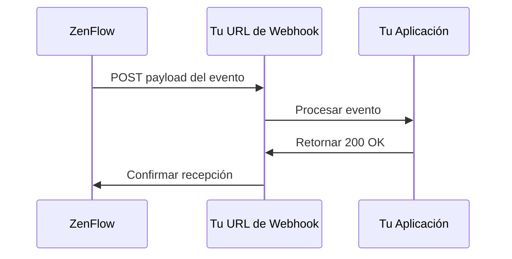

# Webhooks

Los webhooks permiten que tu aplicación reciba notificaciones HTTP en tiempo real cuando ocurren eventos en ZenFlow. En lugar de consultar la API constantemente, los webhooks envían datos a tu servidor tan pronto como algo sucede.

## Cómo Funcionan los Webhooks



1. Ocurre un evento en ZenFlow (ej., pedido creado)
2. ZenFlow envía un HTTP POST a tu URL de webhook
3. Tu servidor procesa el evento
4. Tu servidor responde con código de estado 2xx
5. Si la entrega falla, ZenFlow reintenta con backoff exponencial

## Eventos Disponibles

### Eventos de Pedidos

| Evento            | Descripción                       |
| ----------------- | --------------------------------- |
| `order.created`   | Nuevo pedido creado               |
| `order.updated`   | Detalles del pedido modificados   |
| `order.cancelled` | Pedido cancelado                  |
| `order.completed` | Fulfillment del pedido completado |

### Eventos de Productos

| Evento            | Descripción                       |
| ----------------- | --------------------------------- |
| `product.created` | Nuevo producto agregado           |
| `product.updated` | Detalles del producto modificados |
| `product.deleted` | Producto eliminado                |

### Eventos de Stock

| Evento                   | Descripción                        |
| ------------------------ | ---------------------------------- |
| `stock.updated`          | Nivel de stock modificado          |
| `stock.low_alert`        | Stock por debajo del umbral mínimo |
| `stock.movement_created` | Movimiento de stock registrado     |

### Eventos de Flujo

| Evento           | Descripción                 |
| ---------------- | --------------------------- |
| `flow.started`   | Flujo de picking iniciado   |
| `flow.completed` | Flujo de picking completado |
| `flow.cancelled` | Flujo de picking cancelado  |

## Creando un Webhook

<CodeGroup>

```bash cURL
curl -X POST "https://api.zenflow.com.ar/api/v1/webhooks" \
  -H "X-API-Key: zenflow_live_your_key" \
  -H "Content-Type: application/json" \
  -d '{
    "name": "Notificaciones de Pedidos",
    "url": "https://tu-servidor.com/webhooks/zenflow",
    "events": ["order.created", "order.updated", "order.completed"]
  }'
```

```javascript Node.js
const response = await fetch("https://api.zenflow.com.ar/api/v1/webhooks", {
  method: "POST",
  headers: {
    "X-API-Key": "zenflow_live_your_key",
    "Content-Type": "application/json",
  },
  body: JSON.stringify({
    name: "Notificaciones de Pedidos",
    url: "https://tu-servidor.com/webhooks/zenflow",
    events: ["order.created", "order.updated", "order.completed"],
  }),
});

const data = await response.json();
console.log("Secret del webhook:", data.data.secret);
```

</CodeGroup>

<Warning>
  Guarda el secret del webhook devuelto en la respuesta. Lo necesitarás para
  verificar las firmas de los webhooks. No se mostrará nuevamente.
</Warning>

## Payload del Webhook

Todos los payloads de webhook siguen esta estructura:

```json
{
  "id": "evt_abc123",
  "event": "order.created",
  "created_at": "2024-01-15T10:30:00Z",
  "data": {
    // Datos específicos del evento
  }
}
```

### Ejemplo: Pedido Creado

```json
{
  "id": "evt_abc123",
  "event": "order.created",
  "created_at": "2024-01-15T10:30:00Z",
  "data": {
    "order_id": 12345,
    "order_tenant_id": "ORD-001",
    "state_id": 1,
    "state_name": "Pending",
    "warehouse_id": 1,
    "items_count": 5,
    "created_at": "2024-01-15T10:30:00Z"
  }
}
```

### Ejemplo: Stock Actualizado

```json
{
  "id": "evt_def456",
  "event": "stock.updated",
  "created_at": "2024-01-15T10:30:00Z",
  "data": {
    "product_id": 100,
    "product_name": "Widget A",
    "product_barcode": "7891234567890",
    "location_id": "LOC-A1",
    "warehouse_id": 1,
    "quantity": 50,
    "previous_quantity": 75
  }
}
```

## Verificando Webhooks

Siempre verifica las firmas de los webhooks para asegurar que las solicitudes provienen de ZenFlow.

### Formato de la Firma

ZenFlow incluye una firma en el header `X-Webhook-Signature`:

```
t=1705312200,v1=5d4b8c7a...
```

- `t`: Timestamp Unix cuando se envió el webhook
- `v1`: Firma HMAC-SHA256

### Proceso de Verificación

<CodeGroup>

```javascript Node.js
const crypto = require("crypto");

function verifyWebhookSignature(payload, signature, secret) {
  const parts = signature.split(",");
  const timestamp = parts.find((p) => p.startsWith("t=")).substring(2);
  const expectedSig = parts.find((p) => p.startsWith("v1=")).substring(3);

  // Verifica que el timestamp esté dentro de 5 minutos
  const now = Math.floor(Date.now() / 1000);
  if (Math.abs(now - parseInt(timestamp)) > 300) {
    return false; // Ataque de replay
  }

  // Calcula la firma
  const signedPayload = `${timestamp}.${payload}`;
  const computedSig = crypto
    .createHmac("sha256", secret)
    .update(signedPayload)
    .digest("hex");

  // Comparación de tiempo constante
  return crypto.timingSafeEqual(
    Buffer.from(expectedSig),
    Buffer.from(computedSig)
  );
}

// Ejemplo con Express.js
app.post(
  "/webhooks/zenflow",
  express.raw({ type: "application/json" }),
  (req, res) => {
    const signature = req.headers["x-webhook-signature"];
    const payload = req.body.toString();

    if (
      !verifyWebhookSignature(payload, signature, process.env.WEBHOOK_SECRET)
    ) {
      return res.status(401).send("Firma inválida");
    }

    const event = JSON.parse(payload);
    // Procesar evento...

    res.status(200).send("OK");
  }
);
```

```python Python
import hmac
import hashlib
import time
from flask import Flask, request

def verify_webhook_signature(payload, signature, secret):
    parts = dict(p.split('=') for p in signature.split(','))
    timestamp = parts.get('t')
    expected_sig = parts.get('v1')

    # Verifica timestamp (tolerancia de 5 minutos)
    if abs(time.time() - int(timestamp)) > 300:
        return False

    # Calcula la firma
    signed_payload = f"{timestamp}.{payload}"
    computed_sig = hmac.new(
        secret.encode(),
        signed_payload.encode(),
        hashlib.sha256
    ).hexdigest()

    return hmac.compare_digest(expected_sig, computed_sig)

app = Flask(__name__)

@app.route('/webhooks/zenflow', methods=['POST'])
def handle_webhook():
    signature = request.headers.get('X-Webhook-Signature')
    payload = request.get_data(as_text=True)

    if not verify_webhook_signature(payload, signature, WEBHOOK_SECRET):
        return 'Firma inválida', 401

    event = request.get_json()
    # Procesar evento...

    return 'OK', 200
```

</CodeGroup>

## Política de Reintentos

Si la entrega del webhook falla, ZenFlow reintenta con backoff exponencial:

| Intento   | Delay      |
| --------- | ---------- |
| 1         | Inmediato  |
| 2         | 1 segundo  |
| 3         | 2 segundos |
| 4 (final) | 4 segundos |

Una entrega se considera fallida si:

- Tu servidor retorna un código de estado no-2xx
- La conexión expira (30 segundos por defecto)
- Ocurren errores SSL/TLS

## Mejores Prácticas

<CardGroup cols={2}>
  <Card title="Responde Rápido" icon="bolt">
    Retorna 200 inmediatamente, procesa async
  </Card>
  <Card title="Maneja Duplicados" icon="copy">
    Usa el ID del evento para idempotencia
  </Card>
  <Card title="Verifica Firmas" icon="shield">
    Siempre valida las firmas de los webhooks
  </Card>
  <Card title="Usa HTTPS" icon="lock">
    Solo usa URLs de webhook con HTTPS
  </Card>
</CardGroup>

### Procesamiento Asíncrono

```javascript
app.post("/webhooks/zenflow", (req, res) => {
  // Responde inmediatamente
  res.status(200).send("OK");

  // Procesa en segundo plano
  processWebhookAsync(req.body).catch(console.error);
});

async function processWebhookAsync(event) {
  // Verifica duplicado
  if (await isProcessed(event.id)) {
    return;
  }

  // Procesa evento
  switch (event.event) {
    case "order.created":
      await handleOrderCreated(event.data);
      break;
    // ... otros eventos
  }

  // Marca como procesado
  await markProcessed(event.id);
}
```

## Gestionando Webhooks

### Ver Historial de Entregas

```bash
GET /api/v1/webhooks/:id/deliveries
```

### Probar tu Webhook

```bash
POST /api/v1/webhooks/:id/test
```

Esto envía un evento de prueba para verificar que tu endpoint está funcionando.

### Rotar Secret

Si el secret de tu webhook está comprometido:

```bash
POST /api/v1/webhooks/:id/rotate-secret
```

Actualiza tu servidor con el nuevo secret antes de que el anterior expire.
