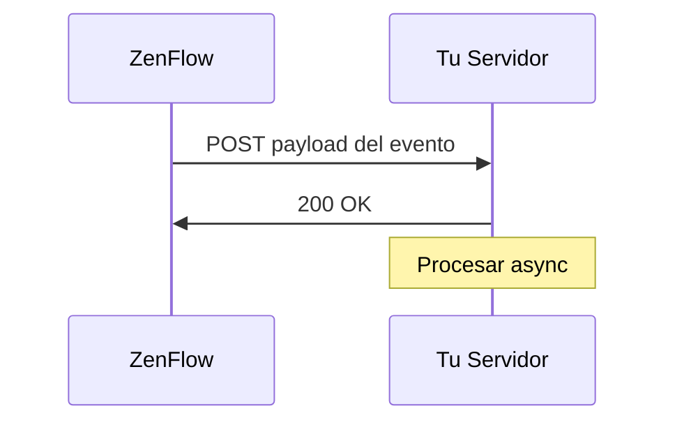

# Webhooks

Los webhooks permiten que tu aplicación reciba notificaciones HTTP en tiempo real cuando ocurren eventos en ZenFlow. En lugar de consultar la API constantemente, los webhooks envían datos a tu servidor tan pronto como algo sucede.

## Cómo Funcionan



1. Te suscribes a uno o más **topics** (eventos)
2. Cuando ocurre un evento, ZenFlow envía un POST a tu URL
3. Tu servidor responde con `2xx` para confirmar recepción
4. Si falla, ZenFlow reintenta con backoff exponencial

## Suscribirse a Webhooks

Para recibir notificaciones, crea un webhook especificando tu URL y los eventos que te interesan:

```bash
POST /api/v1/webhooks
```

```json
{
  "name": "Mis notificaciones",
  "url": "https://tu-servidor.com/webhooks/zenflow",
  "events": ["order/created", "order/updated", "stock/updated"]
}
```

<Warning>
  Guarda el `secret` devuelto en la respuesta. Lo necesitarás para verificar las firmas. No se mostrará nuevamente.
</Warning>

---

## Topics Disponibles

### Pedidos (Orders)

<Accordion title="order/created">
Se dispara cuando se crea un nuevo pedido en ZenFlow.

**Payload:**
```json
{
  "id": "evt_abc123",
  "event": "order/created",
  "created_at": "2024-01-15T10:30:00Z",
  "data": {
    "order_id": 12345,
    "order_tenant_id": "ORD-001",
    "state_id": 1,
    "state_name": "Pendiente",
    "warehouse_id": 1,
    "warehouse_name": "Depósito Central",
    "items_count": 5,
    "total_quantity": 12,
    "source": "api",
    "source_integration": null,
    "created_at": "2024-01-15T10:30:00Z"
  }
}
```

| Campo | Tipo | Descripción |
|-------|------|-------------|
| `order_id` | integer | ID interno del pedido |
| `order_tenant_id` | string | ID del pedido en tu sistema |
| `state_id` | integer | ID del estado actual |
| `state_name` | string | Nombre del estado |
| `warehouse_id` | integer | ID del almacén asignado |
| `items_count` | integer | Cantidad de líneas/productos |
| `total_quantity` | integer | Cantidad total de unidades |
| `source` | string | Origen: `api`, `integration`, `manual` |
| `source_integration` | string | Integración origen (si aplica) |
</Accordion>

<Accordion title="order/updated">
Se dispara cuando se modifican los detalles de un pedido (estado, items, etc).

**Payload:**
```json
{
  "id": "evt_def456",
  "event": "order/updated",
  "created_at": "2024-01-15T11:00:00Z",
  "data": {
    "order_id": 12345,
    "order_tenant_id": "ORD-001",
    "state_id": 3,
    "state_name": "En Preparación",
    "previous_state_id": 1,
    "previous_state_name": "Pendiente",
    "warehouse_id": 1,
    "updated_fields": ["state_id"],
    "updated_at": "2024-01-15T11:00:00Z"
  }
}
```

| Campo | Tipo | Descripción |
|-------|------|-------------|
| `previous_state_id` | integer | Estado anterior |
| `previous_state_name` | string | Nombre del estado anterior |
| `updated_fields` | array | Campos que fueron modificados |
</Accordion>

<Accordion title="order/cancelled">
Se dispara cuando un pedido es cancelado.

**Payload:**
```json
{
  "id": "evt_ghi789",
  "event": "order/cancelled",
  "created_at": "2024-01-15T12:00:00Z",
  "data": {
    "order_id": 12345,
    "order_tenant_id": "ORD-001",
    "state_id": 7,
    "state_name": "Cancelado",
    "previous_state_id": 1,
    "previous_state_name": "Pendiente",
    "cancellation_reason": "Cliente solicitó cancelación",
    "cancelled_by": "user@empresa.com",
    "cancelled_at": "2024-01-15T12:00:00Z"
  }
}
```

| Campo | Tipo | Descripción |
|-------|------|-------------|
| `cancellation_reason` | string | Motivo de la cancelación |
| `cancelled_by` | string | Usuario que canceló |
</Accordion>

<Accordion title="order/completed">
Se dispara cuando un pedido completa su fulfillment (preparado y listo para envío).

**Payload:**
```json
{
  "id": "evt_jkl012",
  "event": "order/completed",
  "created_at": "2024-01-15T14:00:00Z",
  "data": {
    "order_id": 12345,
    "order_tenant_id": "ORD-001",
    "state_id": 5,
    "state_name": "Completado",
    "warehouse_id": 1,
    "items_picked": 5,
    "total_quantity_picked": 12,
    "picked_by": "operador@empresa.com",
    "started_at": "2024-01-15T13:00:00Z",
    "completed_at": "2024-01-15T14:00:00Z",
    "duration_minutes": 60
  }
}
```

| Campo | Tipo | Descripción |
|-------|------|-------------|
| `items_picked` | integer | Líneas preparadas |
| `total_quantity_picked` | integer | Unidades totales preparadas |
| `picked_by` | string | Operador que preparó |
| `duration_minutes` | integer | Tiempo de preparación |
</Accordion>

---

### Productos (Products)

<Accordion title="product/created">
Se dispara cuando se crea un nuevo producto.

**Payload:**
```json
{
  "id": "evt_mno345",
  "event": "product/created",
  "created_at": "2024-01-15T10:30:00Z",
  "data": {
    "product_id": 100,
    "sku": "PROD-001",
    "barcode": "7891234567890",
    "name": "Widget A",
    "description": "Descripción del producto",
    "category": "Electrónica",
    "price": 1500.00,
    "cost": 800.00,
    "weight": 0.5,
    "created_at": "2024-01-15T10:30:00Z"
  }
}
```
</Accordion>

<Accordion title="product/updated">
Se dispara cuando se modifican los detalles de un producto.

**Payload:**
```json
{
  "id": "evt_pqr678",
  "event": "product/updated",
  "created_at": "2024-01-15T11:00:00Z",
  "data": {
    "product_id": 100,
    "sku": "PROD-001",
    "barcode": "7891234567890",
    "name": "Widget A - Actualizado",
    "updated_fields": ["name", "price"],
    "updated_at": "2024-01-15T11:00:00Z"
  }
}
```
</Accordion>

<Accordion title="product/deleted">
Se dispara cuando se elimina un producto.

**Payload:**
```json
{
  "id": "evt_stu901",
  "event": "product/deleted",
  "created_at": "2024-01-15T12:00:00Z",
  "data": {
    "product_id": 100,
    "sku": "PROD-001",
    "barcode": "7891234567890",
    "name": "Widget A",
    "deleted_at": "2024-01-15T12:00:00Z"
  }
}
```
</Accordion>

---

### Stock

<Accordion title="stock/updated">
Se dispara cuando cambia el nivel de stock de un producto en una ubicación.

**Payload:**
```json
{
  "id": "evt_vwx234",
  "event": "stock/updated",
  "created_at": "2024-01-15T10:30:00Z",
  "data": {
    "product_id": 100,
    "sku": "PROD-001",
    "barcode": "7891234567890",
    "product_name": "Widget A",
    "warehouse_id": 1,
    "warehouse_name": "Depósito Central",
    "location_id": "A-01-01",
    "quantity": 50,
    "previous_quantity": 75,
    "change": -25,
    "reason": "order_fulfillment",
    "reference_id": "ORD-001"
  }
}
```

| Campo | Tipo | Descripción |
|-------|------|-------------|
| `quantity` | integer | Nueva cantidad |
| `previous_quantity` | integer | Cantidad anterior |
| `change` | integer | Diferencia (+ o -) |
| `reason` | string | Motivo del cambio |
| `reference_id` | string | ID de referencia (pedido, ajuste, etc) |

**Valores de `reason`:**
- `order_fulfillment` - Preparación de pedido
- `manual_adjustment` - Ajuste manual
- `stock_receipt` - Recepción de mercadería
- `transfer` - Transferencia entre ubicaciones
- `return` - Devolución
- `inventory_count` - Conteo de inventario
</Accordion>

<Accordion title="stock/low_alert">
Se dispara cuando el stock de un producto cae por debajo del umbral mínimo configurado.

**Payload:**
```json
{
  "id": "evt_yz0567",
  "event": "stock/low_alert",
  "created_at": "2024-01-15T10:30:00Z",
  "data": {
    "product_id": 100,
    "sku": "PROD-001",
    "barcode": "7891234567890",
    "product_name": "Widget A",
    "warehouse_id": 1,
    "warehouse_name": "Depósito Central",
    "current_quantity": 5,
    "minimum_threshold": 10,
    "suggested_reorder": 50
  }
}
```

| Campo | Tipo | Descripción |
|-------|------|-------------|
| `current_quantity` | integer | Stock actual |
| `minimum_threshold` | integer | Umbral mínimo configurado |
| `suggested_reorder` | integer | Cantidad sugerida a reponer |
</Accordion>

<Accordion title="stock/movement_created">
Se dispara cuando se registra un movimiento de stock (entrada, salida, transferencia).

**Payload:**
```json
{
  "id": "evt_abc890",
  "event": "stock/movement_created",
  "created_at": "2024-01-15T10:30:00Z",
  "data": {
    "movement_id": 5678,
    "type": "transfer",
    "product_id": 100,
    "sku": "PROD-001",
    "product_name": "Widget A",
    "quantity": 20,
    "from_location": "A-01-01",
    "to_location": "B-02-03",
    "warehouse_id": 1,
    "created_by": "operador@empresa.com",
    "notes": "Reubicación por espacio",
    "created_at": "2024-01-15T10:30:00Z"
  }
}
```

| Campo | Tipo | Descripción |
|-------|------|-------------|
| `type` | string | Tipo: `receipt`, `dispatch`, `transfer`, `adjustment` |
| `from_location` | string | Ubicación origen (null si es entrada) |
| `to_location` | string | Ubicación destino (null si es salida) |
</Accordion>

---

### Flujos de Picking (Flows)

<Accordion title="flow/started">
Se dispara cuando un operador inicia un flujo de picking.

**Payload:**
```json
{
  "id": "evt_def123",
  "event": "flow/started",
  "created_at": "2024-01-15T13:00:00Z",
  "data": {
    "flow_id": 789,
    "order_id": 12345,
    "order_tenant_id": "ORD-001",
    "warehouse_id": 1,
    "operator_id": 5,
    "operator_email": "operador@empresa.com",
    "items_to_pick": 5,
    "total_quantity": 12,
    "started_at": "2024-01-15T13:00:00Z"
  }
}
```
</Accordion>

<Accordion title="flow/completed">
Se dispara cuando un flujo de picking se completa exitosamente.

**Payload:**
```json
{
  "id": "evt_ghi456",
  "event": "flow/completed",
  "created_at": "2024-01-15T14:00:00Z",
  "data": {
    "flow_id": 789,
    "order_id": 12345,
    "order_tenant_id": "ORD-001",
    "warehouse_id": 1,
    "operator_id": 5,
    "operator_email": "operador@empresa.com",
    "items_picked": 5,
    "total_quantity_picked": 12,
    "started_at": "2024-01-15T13:00:00Z",
    "completed_at": "2024-01-15T14:00:00Z",
    "duration_minutes": 60
  }
}
```
</Accordion>

<Accordion title="flow/cancelled">
Se dispara cuando un flujo de picking es cancelado.

**Payload:**
```json
{
  "id": "evt_jkl789",
  "event": "flow/cancelled",
  "created_at": "2024-01-15T13:30:00Z",
  "data": {
    "flow_id": 789,
    "order_id": 12345,
    "order_tenant_id": "ORD-001",
    "warehouse_id": 1,
    "operator_id": 5,
    "operator_email": "operador@empresa.com",
    "cancellation_reason": "Producto no disponible",
    "items_picked_before_cancel": 2,
    "started_at": "2024-01-15T13:00:00Z",
    "cancelled_at": "2024-01-15T13:30:00Z"
  }
}
```
</Accordion>

---

## Estructura del Payload

Todos los payloads siguen esta estructura base:

```json
{
  "id": "evt_abc123",
  "event": "order/created",
  "created_at": "2024-01-15T10:30:00Z",
  "data": {
    // Datos específicos del evento
  }
}
```

| Campo | Tipo | Descripción |
|-------|------|-------------|
| `id` | string | ID único del evento (usar para idempotencia) |
| `event` | string | Topic del evento |
| `created_at` | string | Timestamp ISO 8601 |
| `data` | object | Payload específico del evento |

## Verificando Webhooks

Siempre verifica las firmas de los webhooks para asegurar que las solicitudes provienen de ZenFlow.

### Formato de la Firma

ZenFlow incluye una firma en el header `X-Webhook-Signature`:

```
t=1705312200,v1=5d4b8c7a...
```

- `t`: Timestamp Unix cuando se envió el webhook
- `v1`: Firma HMAC-SHA256

### Proceso de Verificación

<CodeGroup>

```javascript Node.js
const crypto = require("crypto");

function verifyWebhookSignature(payload, signature, secret) {
  const parts = signature.split(",");
  const timestamp = parts.find((p) => p.startsWith("t=")).substring(2);
  const expectedSig = parts.find((p) => p.startsWith("v1=")).substring(3);

  // Verifica que el timestamp esté dentro de 5 minutos
  const now = Math.floor(Date.now() / 1000);
  if (Math.abs(now - parseInt(timestamp)) > 300) {
    return false; // Ataque de replay
  }

  // Calcula la firma
  const signedPayload = `${timestamp}.${payload}`;
  const computedSig = crypto
    .createHmac("sha256", secret)
    .update(signedPayload)
    .digest("hex");

  // Comparación de tiempo constante
  return crypto.timingSafeEqual(
    Buffer.from(expectedSig),
    Buffer.from(computedSig)
  );
}

// Ejemplo con Express.js
app.post(
  "/webhooks/zenflow",
  express.raw({ type: "application/json" }),
  (req, res) => {
    const signature = req.headers["x-webhook-signature"];
    const payload = req.body.toString();

    if (
      !verifyWebhookSignature(payload, signature, process.env.WEBHOOK_SECRET)
    ) {
      return res.status(401).send("Firma inválida");
    }

    const event = JSON.parse(payload);
    // Procesar evento...

    res.status(200).send("OK");
  }
);
```

```python Python
import hmac
import hashlib
import time
from flask import Flask, request

def verify_webhook_signature(payload, signature, secret):
    parts = dict(p.split('=') for p in signature.split(','))
    timestamp = parts.get('t')
    expected_sig = parts.get('v1')

    # Verifica timestamp (tolerancia de 5 minutos)
    if abs(time.time() - int(timestamp)) > 300:
        return False

    # Calcula la firma
    signed_payload = f"{timestamp}.{payload}"
    computed_sig = hmac.new(
        secret.encode(),
        signed_payload.encode(),
        hashlib.sha256
    ).hexdigest()

    return hmac.compare_digest(expected_sig, computed_sig)

app = Flask(__name__)

@app.route('/webhooks/zenflow', methods=['POST'])
def handle_webhook():
    signature = request.headers.get('X-Webhook-Signature')
    payload = request.get_data(as_text=True)

    if not verify_webhook_signature(payload, signature, WEBHOOK_SECRET):
        return 'Firma inválida', 401

    event = request.get_json()
    # Procesar evento...

    return 'OK', 200
```

</CodeGroup>

## Política de Reintentos

Si la entrega del webhook falla, ZenFlow reintenta con backoff exponencial:

| Intento   | Delay      |
| --------- | ---------- |
| 1         | Inmediato  |
| 2         | 1 segundo  |
| 3         | 2 segundos |
| 4 (final) | 4 segundos |

Una entrega se considera fallida si:

- Tu servidor retorna un código de estado no-2xx
- La conexión expira (30 segundos por defecto)
- Ocurren errores SSL/TLS

## Mejores Prácticas

<CardGroup cols={2}>
  <Card title="Responde Rápido" icon="bolt">
    Retorna 200 inmediatamente, procesa async
  </Card>
  <Card title="Maneja Duplicados" icon="copy">
    Usa el ID del evento para idempotencia
  </Card>
  <Card title="Verifica Firmas" icon="shield">
    Siempre valida las firmas de los webhooks
  </Card>
  <Card title="Usa HTTPS" icon="lock">
    Solo usa URLs de webhook con HTTPS
  </Card>
</CardGroup>

### Procesamiento Asíncrono

```javascript
app.post("/webhooks/zenflow", (req, res) => {
  // Responde inmediatamente
  res.status(200).send("OK");

  // Procesa en segundo plano
  processWebhookAsync(req.body).catch(console.error);
});

async function processWebhookAsync(event) {
  // Verifica duplicado
  if (await isProcessed(event.id)) {
    return;
  }

  // Procesa evento
  switch (event.event) {
    case "order.created":
      await handleOrderCreated(event.data);
      break;
    // ... otros eventos
  }

  // Marca como procesado
  await markProcessed(event.id);
}
```

## Gestionando Webhooks

### Ver Historial de Entregas

```bash
GET /api/v1/webhooks/:id/deliveries
```

### Probar tu Webhook

```bash
POST /api/v1/webhooks/:id/test
```

Esto envía un evento de prueba para verificar que tu endpoint está funcionando.

### Rotar Secret

Si el secret de tu webhook está comprometido:

```bash
POST /api/v1/webhooks/:id/rotate-secret
```

Actualiza tu servidor con el nuevo secret antes de que el anterior expire.
