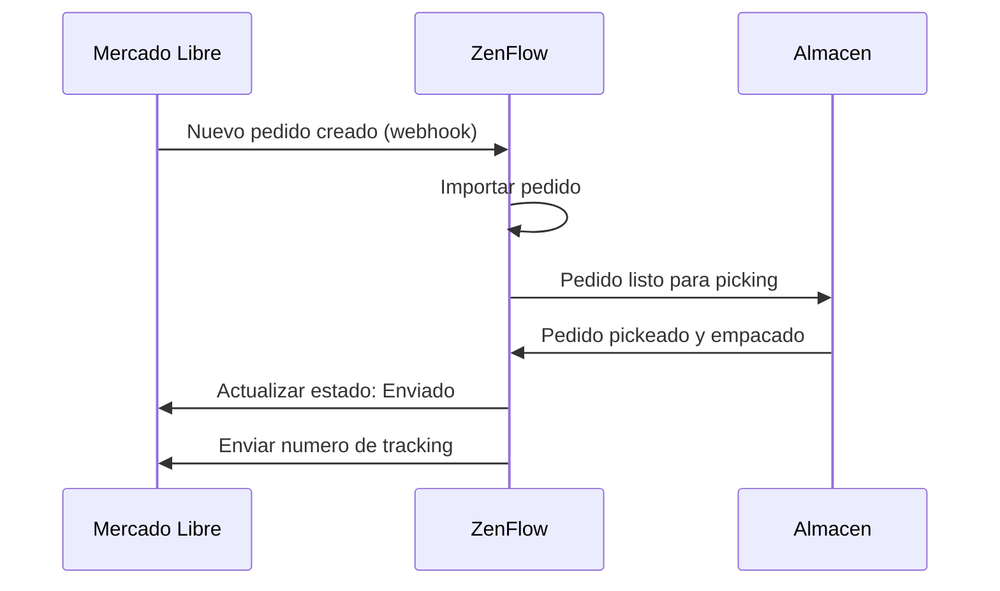

# Integracion con Mercado Libre

Conecta tu cuenta de vendedor de Mercado Libre con ZenFlow para importar pedidos automaticamente, sincronizar inventario y actualizar estados de pedidos.

<Note>
  Esta integracion soporta cuentas de Mercado Libre en Argentina, Brasil, Mexico, Colombia, Chile, Uruguay y Peru. **Incluye soporte para MercadoShops** como canal adicional.
</Note>

## Canales Soportados

Esta integracion incluye soporte para:

- **Mercado Libre** - Marketplace principal
- **MercadoShops** - Tu tienda online propia dentro del ecosistema de Mercado Libre

Ambos canales se gestionan desde la misma integracion. Los pedidos de MercadoShops se importan automaticamente junto con los de Mercado Libre.

## Caracteristicas

<CardGroup cols={2}>
  <Card title="Importar Pedidos" icon="download">
    Importa pedidos de Mercado Libre y MercadoShops
  </Card>
  <Card title="Actualizar Estados" icon="rotate">
    Envia el estado de fulfillment de vuelta a Mercado Libre
  </Card>
  <Card title="Sync Inventario" icon="warehouse">
    Mantiene los niveles de stock sincronizados en tiempo real
  </Card>
  <Card title="Multi-cuenta" icon="users">
    Conecta multiples cuentas de Mercado Libre
  </Card>
</CardGroup>

## Guia de Configuracion

### Paso 1: Conectar tu Cuenta

1. Ve a **Configuracion** > **Integraciones** en ZenFlow
2. Haz clic en **Conectar Mercado Libre**
3. Inicia sesion con tu cuenta de vendedor de Mercado Libre
4. Autoriza a ZenFlow para acceder a tu cuenta

<Warning>
  Asegurate de iniciar sesion con una cuenta de vendedor que tenga publicaciones activas. Las cuentas solo de comprador no pueden integrarse.
</Warning>

### Paso 2: Configurar Sincronizacion

Despues de conectar, configura tus preferencias:

```
Configuracion de Pedidos:
- Importar pedidos automaticamente: Si
- Estado de pedidos a importar: Todos / Solo pagados
- Asignar a almacen: [Seleccionar almacen]

Configuracion de Inventario:
- Sincronizar inventario: Si
- Frecuencia de sync: Tiempo real / Cada 15 min / Cada hora
- Buffer de stock: 0 (stock de seguridad opcional)
```

### Paso 3: Mapear Productos (Opcional)

Si tus productos tienen SKUs diferentes en Mercado Libre vs ZenFlow, configura el mapeo de productos:

| SKU Mercado Libre | SKU ZenFlow |
|-------------------|-------------|
| MLB-12345 | PROD-001 |
| MLB-67890 | PROD-002 |

## Flujo de Pedidos



## Referencia API

### Obtener Cuentas Conectadas

```bash
GET /api/v1/integrations/mercadolibre/accounts
```

Respuesta:
```json
{
  "success": true,
  "data": {
    "accounts": [
      {
        "id": "123456789",
        "nickname": "MITIENDA",
        "site_id": "MLA",
        "connected_at": "2024-01-15T10:30:00Z",
        "status": "active"
      }
    ]
  }
}
```

### Sincronizar Pedidos Manualmente

```bash
POST /api/v1/integrations/mercadolibre/sync/orders
```

Request:
```json
{
  "account_id": "123456789",
  "date_from": "2024-01-01",
  "date_to": "2024-01-15"
}
```

### Actualizar Inventario

```bash
POST /api/v1/integrations/mercadolibre/inventory/sync
```

Request:
```json
{
  "account_id": "123456789",
  "items": [
    {
      "item_id": "MLA1234567890",
      "available_quantity": 50
    }
  ]
}
```

## Webhooks

ZenFlow escucha automaticamente estos eventos de Mercado Libre:

| Evento | Descripcion |
|--------|-------------|
| `orders_v2` | Pedido nuevo creado o actualizado |
| `shipments` | Estado de envio cambiado |
| `items` | Publicacion de producto actualizada |
| `questions` | Nueva pregunta recibida (opcional) |

## Solucion de Problemas

### Pedidos No Se Importan

<Accordion title="Verificar estado de conexion">
  Ve a **Configuracion** > **Integraciones** y verifica que tu cuenta de Mercado Libre muestre "Conectada". Si esta desconectada, re-autoriza la conexion.
</Accordion>

<Accordion title="Verificar configuracion de webhooks">
  Los webhooks de Mercado Libre deberian configurarse automaticamente. Si faltan pedidos, intenta sincronizar manualmente los pedidos del rango de fechas afectado.
</Accordion>

### Inventario No Se Actualiza

<Accordion title="Verificar mapeo de productos">
  Asegurate de que tus productos esten correctamente mapeados entre los SKUs de ZenFlow y Mercado Libre.
</Accordion>

<Accordion title="Verificar configuracion de sync">
  Verifica que la sincronizacion de inventario este habilitada en tu configuracion de integracion.
</Accordion>

## Limites de Tasa

Mercado Libre impone limites de tasa en la API:

| Tipo de Endpoint | Limite |
|------------------|--------|
| Pedidos | 10,000 requests/hora |
| Items | 10,000 requests/hora |
| Inventario | 3,000 requests/hora |

ZenFlow maneja automaticamente los limites de tasa y reintentos.

## Soporte

- [Documentacion de Desarrolladores Mercado Libre](https://developers.mercadolibre.com)
- Contacta a [support@zenflow.com](mailto:support@zenflow.com) para ayuda con la integracion
