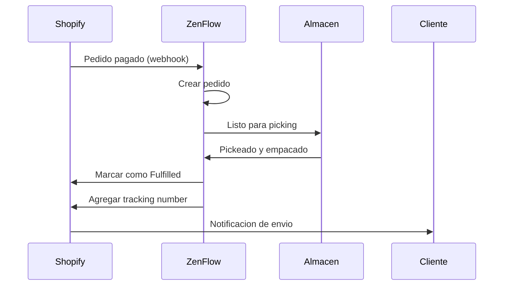

# Integracion con Shopify

Conecta tu tienda Shopify con ZenFlow para importar pedidos automaticamente, sincronizar inventario y optimizar tus operaciones de fulfillment.

<Note>
  Esta integracion soporta tiendas Shopify de cualquier pais. Compatible con Shopify y Shopify Plus.
</Note>

## Caracteristicas

<CardGroup cols={2}>
  <Card title="Importar Pedidos" icon="download">
    Importa automaticamente pedidos pagados de Shopify
  </Card>
  <Card title="Actualizar Estados" icon="rotate">
    Marca pedidos como fulfillados y envia info de tracking
  </Card>
  <Card title="Sync Inventario" icon="warehouse">
    Sincronizacion de stock en tiempo real hacia Shopify
  </Card>
  <Card title="Mapeo de Productos" icon="barcode">
    Vincula productos de Shopify con tu catalogo en ZenFlow
  </Card>
</CardGroup>

## Guia de Configuracion

### Paso 1: Conectar tu Tienda

1. Ve a **Configuracion** > **Integraciones** en ZenFlow
2. Haz clic en **Conectar Shopify**
3. Ingresa el dominio de tu tienda (ej: `mitienda.myshopify.com`)
4. Seras redirigido a Shopify para autorizar la aplicacion
5. Acepta los permisos solicitados

<Note>
  ZenFlow solicita permisos para leer/escribir pedidos, productos e inventario. Estos son necesarios para la sincronizacion bidireccional.
</Note>

### Paso 2: Configurar Sincronizacion

Despues de conectar, establece tus preferencias:

```
Configuracion de Pedidos:
- Sincronizar pedidos: Si/No
- Importar solo pagados: Si/No
- Almacen por defecto: [Seleccionar]

Configuracion de Inventario:
- Sincronizar stock: Si/No
- Direccion: ZenFlow -> Shopify
```

### Paso 3: Mapear Productos

Vincula tus productos de Shopify con ZenFlow:

1. Ve a **Integraciones** > **Shopify** > **Mapeo de Productos**
2. ZenFlow intentara coincidir automaticamente por SKU
3. Para productos no coincidentes, selecciona el producto ZenFlow manualmente

## Flujo de Pedidos



## Referencia API

### Iniciar Autorizacion

```bash
POST /api/v1/integrations/shopify/auth/start
```

Request:
```json
{
  "shop_domain": "mitienda.myshopify.com",
  "warehouse_id": 1
}
```

Respuesta:
```json
{
  "success": true,
  "data": {
    "authorization_url": "https://mitienda.myshopify.com/admin/oauth/authorize?..."
  }
}
```

### Obtener Estado de Conexion

```bash
GET /api/v1/integrations/shopify/status
```

Respuesta:
```json
{
  "success": true,
  "data": {
    "connected": true,
    "shop_domain": "mitienda.myshopify.com",
    "shop_name": "Mi Tienda",
    "status": "active",
    "sync_orders": true,
    "sync_stock": true,
    "last_sync_at": "2024-01-20T15:45:00Z"
  }
}
```

### Actualizar Configuracion

```bash
PUT /api/v1/integrations/shopify/config
```

Request:
```json
{
  "sync_orders": true,
  "sync_stock": true
}
```

### Sincronizar Pedidos Manualmente

```bash
POST /api/v1/integrations/shopify/sync/orders
```

Request:
```json
{
  "date_from": "2024-01-01",
  "date_to": "2024-01-31"
}
```

### Sincronizar Stock a Shopify

```bash
POST /api/v1/integrations/shopify/sync/stock
```

Sincroniza todos los niveles de inventario de productos mapeados hacia Shopify.

### Listar Mapeos de Productos

```bash
GET /api/v1/integrations/shopify/mappings
```

Respuesta:
```json
{
  "success": true,
  "data": {
    "mappings": [
      {
        "id": 1,
        "product_id": 100,
        "product_sku": "PROD-001",
        "shopify_product_id": "7654321098765",
        "shopify_variant_id": "43210987654321",
        "shopify_sku": "PROD-001",
        "sync_stock": true,
        "last_stock_sync": "2024-01-20T15:45:00Z"
      }
    ]
  }
}
```

### Crear Mapeo de Producto

```bash
POST /api/v1/integrations/shopify/mappings
```

Request:
```json
{
  "product_id": 100,
  "shopify_product_id": "7654321098765",
  "shopify_variant_id": "43210987654321",
  "sync_stock": true
}
```

### Eliminar Mapeo

```bash
DELETE /api/v1/integrations/shopify/mappings/:id
```

### Desconectar Tienda

```bash
DELETE /api/v1/integrations/shopify/disconnect
```

## Eventos Webhook

ZenFlow recibe estos webhooks de Shopify automaticamente:

| Topic | Descripcion | Accion en ZenFlow |
|-------|-------------|-------------------|
| `orders/create` | Nuevo pedido creado | Importa el pedido si esta pagado |
| `orders/paid` | Pago confirmado | Importa el pedido para fulfillment |
| `orders/updated` | Pedido actualizado | Registra cambios |
| `orders/cancelled` | Pedido cancelado | Cancela el pedido en ZenFlow |
| `orders/fulfilled` | Pedido fulfillado | Registra el fulfillment |
| `products/create` | Producto creado | Registra para mapeo |
| `products/update` | Producto actualizado | Actualiza info de mapeo |
| `products/delete` | Producto eliminado | Elimina mapeo |
| `inventory_levels/update` | Stock actualizado | Registra cambio (si bidireccional) |
| `app/uninstalled` | App desinstalada | Revoca credenciales |

## Mapeo de Productos

### Coincidencia Automatica

ZenFlow intenta coincidir productos automaticamente usando:

1. **SKU** (coincidencia exacta)
2. **Codigo de barras** (si esta configurado en Shopify)

### Mapeo Manual

Para productos que no coinciden automaticamente:

1. Ve a **Integraciones** > **Shopify** > **Mapeo de Productos**
2. Filtra por "Sin mapear"
3. Selecciona el producto ZenFlow correspondiente

### Productos con Variantes

Cada variante de Shopify se mapea a un producto separado en ZenFlow:

| Shopify | ZenFlow |
|---------|---------|
| Remera Azul (S) | REMERA-AZUL-S |
| Remera Azul (M) | REMERA-AZUL-M |
| Remera Azul (L) | REMERA-AZUL-L |
| Remera Roja (S) | REMERA-ROJA-S |

## Mapeo de Estados

| Estado Shopify | Estado ZenFlow |
|----------------|----------------|
| `unfulfilled` | Listo para preparar |
| `partial` | En progreso |
| `fulfilled` | Enviado |
| `restocked` | Cancelado |

## Solucion de Problemas

### Pedidos No Se Importan

<Accordion title="Verificar configuracion de sync">
  Asegurate de que `sync_orders` este habilitado en la configuracion. Ve a **Integraciones** > **Shopify** > **Configuracion**.
</Accordion>

<Accordion title="Verificar estado del pedido">
  Por defecto, solo se importan pedidos con estado `paid`. Verifica que el pedido tenga el pago confirmado en Shopify.
</Accordion>

<Accordion title="Verificar webhooks">
  Los webhooks se registran automaticamente. Si hay problemas, desconecta y vuelve a conectar la integracion.
</Accordion>

### Stock No Se Sincroniza

<Accordion title="Verificar mapeo de producto">
  El producto debe estar mapeado correctamente. Verifica que exista un mapeo en **Mapeo de Productos**.
</Accordion>

<Accordion title="Verificar flag de sync">
  Cada mapeo tiene un flag `sync_stock`. Asegurate de que este habilitado para los productos que quieres sincronizar.
</Accordion>

<Accordion title="Verificar ubicaciones en Shopify">
  ZenFlow sincroniza con la ubicacion principal de Shopify. Si tienes multiples ubicaciones, verifica cual esta configurada como principal.
</Accordion>

### Error de Autorizacion

<Accordion title="Permisos insuficientes">
  Si la autorizacion falla, verifica que hayas aceptado todos los permisos solicitados. Intenta desconectar y volver a conectar.
</Accordion>

<Accordion title="Token expirado">
  Los tokens de Shopify son de larga duracion. Si expira, desconecta y reconecta la integracion.
</Accordion>

## Limites de Tasa

| Operacion | Limite |
|-----------|--------|
| Llamadas API | 2 requests/segundo |
| Bucket de tokens | 40 tokens |

ZenFlow maneja los limites de tasa automaticamente con backoff exponencial y respeta el algoritmo de "leaky bucket" de Shopify.

## Scopes Requeridos

La integracion solicita los siguientes permisos:

- `read_orders`, `write_orders` - Leer y actualizar pedidos
- `read_products`, `write_products` - Leer y actualizar productos
- `read_inventory`, `write_inventory` - Gestionar niveles de stock
- `read_locations` - Leer ubicaciones de inventario
- `read_fulfillments`, `write_fulfillments` - Gestionar fulfillments

## Soporte

- [Documentacion de Shopify API](https://shopify.dev/docs/api)
- Contacta a [support@zenflow.com](mailto:support@zenflow.com) para ayuda con la integracion
