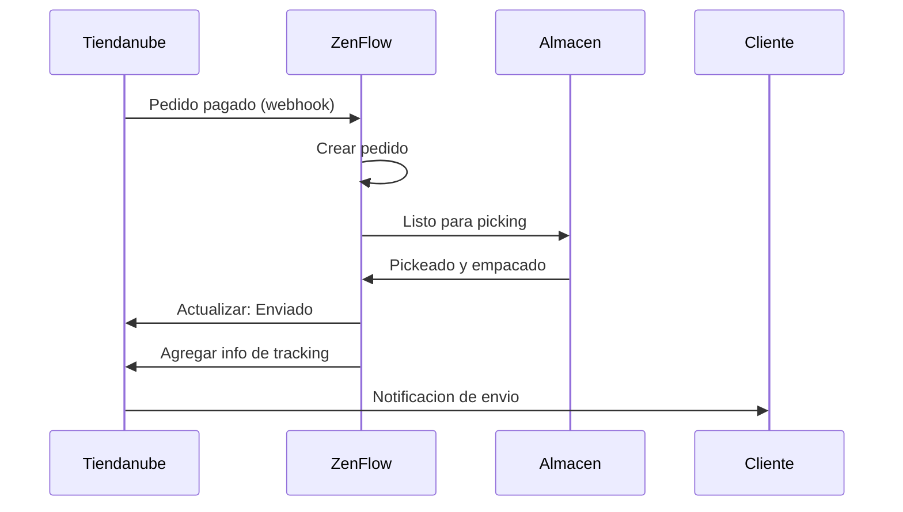

# Integracion con Tiendanube

Conecta tu tienda Tiendanube con ZenFlow para importar pedidos automaticamente, sincronizar inventario y optimizar tus operaciones de fulfillment.

<Note>
  Esta integracion soporta tiendas Tiendanube en Argentina, Brasil, Mexico, Colombia y Chile.
</Note>

## Caracteristicas

<CardGroup cols={2}>
  <Card title="Importar Pedidos" icon="download">
    Importa automaticamente pedidos pagados de Tiendanube
  </Card>
  <Card title="Actualizar Estados" icon="rotate">
    Actualiza el estado del pedido y envio en tu tienda
  </Card>
  <Card title="Sync Inventario" icon="warehouse">
    Sincronizacion de stock en tiempo real
  </Card>
  <Card title="Sync Productos" icon="barcode">
    Importa y sincroniza tu catalogo de productos
  </Card>
</CardGroup>

## Guia de Configuracion

### Paso 1: Conectar tu Tienda

1. Ve a **Configuracion** > **Integraciones** en ZenFlow
2. Haz clic en **Conectar Tiendanube**
3. Ingresa la URL de tu tienda Tiendanube (ej: `mitienda.tiendanube.com`)
4. Inicia sesion y autoriza a ZenFlow

### Paso 2: Configurar Importacion

Despues de conectar, establece tus preferencias:

```
Configuracion de Pedidos:
- Importar pedidos: Solo pagados / Todos los pedidos
- Almacen por defecto: [Seleccionar]
- Auto-asignar flujo de picking: Si/No

Configuracion de Productos:
- Sincronizar productos: Si/No
- Coincidir por: SKU / Codigo de barras / Nombre
- Crear productos faltantes: Si/No

Configuracion de Inventario:
- Direccion de sync: ZenFlow -> Tiendanube / Bidireccional
- Frecuencia de sync: Tiempo real / Cada 15 min / Cada hora
```

### Paso 3: Sincronizacion Inicial

Haz clic en **Sincronizar Ahora** para realizar una sincronizacion inicial:
1. Importar productos existentes
2. Importar pedidos pendientes
3. Sincronizar niveles de inventario actuales

## Flujo de Pedidos



## Referencia API

### Obtener Conexion de Tienda

```bash
GET /api/v1/integrations/tiendanube/stores
```

Respuesta:
```json
{
  "success": true,
  "data": {
    "stores": [
      {
        "id": "1234567",
        "name": "Mi Tienda",
        "url": "mitienda.tiendanube.com",
        "country": "AR",
        "connected_at": "2024-01-15T10:30:00Z",
        "status": "active",
        "last_sync": "2024-01-20T15:45:00Z"
      }
    ]
  }
}
```

### Sincronizar Pedidos

```bash
POST /api/v1/integrations/tiendanube/sync/orders
```

Request:
```json
{
  "store_id": "1234567",
  "date_from": "2024-01-01",
  "status": ["paid", "packed"]
}
```

### Sincronizar Productos

```bash
POST /api/v1/integrations/tiendanube/sync/products
```

Request:
```json
{
  "store_id": "1234567",
  "create_missing": true,
  "update_existing": true
}
```

### Actualizar Inventario

```bash
POST /api/v1/integrations/tiendanube/inventory/update
```

Request:
```json
{
  "store_id": "1234567",
  "products": [
    {
      "sku": "PROD-001",
      "stock": 100
    },
    {
      "sku": "PROD-002",
      "stock": 50
    }
  ]
}
```

## Eventos Webhook

ZenFlow recibe estos eventos de Tiendanube:

| Evento | Descripcion |
|--------|-------------|
| `order/created` | Nuevo pedido creado |
| `order/paid` | Pago del pedido confirmado |
| `order/fulfilled` | Pedido marcado como enviado |
| `order/cancelled` | Pedido cancelado |
| `product/created` | Nuevo producto agregado |
| `product/updated` | Detalles del producto cambiados |

## Mapeo de Productos

### Coincidencia Automatica

ZenFlow intenta coincidir productos automaticamente usando:
1. SKU (coincidencia exacta)
2. Codigo de barras / EAN
3. Nombre del producto (coincidencia difusa)

### Mapeo Manual

Para productos que no pueden coincidir automaticamente:

1. Ve a **Integraciones** > **Tiendanube** > **Mapeo de Productos**
2. Ver productos sin coincidir
3. Selecciona el producto ZenFlow correspondiente para cada uno

```json
{
  "mappings": [
    {
      "tiendanube_product_id": "12345",
      "tiendanube_variant_id": "67890",
      "zenflow_product_id": 100,
      "zenflow_sku": "PROD-001"
    }
  ]
}
```

## Productos Multi-variante

Para productos con variantes (talle, color, etc.):

- Cada variante mapea a un producto ZenFlow separado
- El stock se rastrea por variante
- Los pedidos incluyen detalles especificos de variante

Ejemplo de mapeo:
| Tiendanube | ZenFlow |
|------------|---------|
| Remera (S) | REMERA-S |
| Remera (M) | REMERA-M |
| Remera (L) | REMERA-L |

## Solucion de Problemas

### Pedidos No Se Sincronizan

<Accordion title="Verificar configuracion de webhooks">
  Verifica que los webhooks de Tiendanube esten configurados correctamente. Ve a tu panel de admin de Tiendanube > Apps > ZenFlow para verificar la conexion.
</Accordion>

<Accordion title="Verificar filtro de estado de pedido">
  Por defecto, solo se importan pedidos "pagados". Ajusta tu configuracion si necesitas importar pedidos en otros estados.
</Accordion>

### Desajuste de Inventario

<Accordion title="Verificar direccion de sync">
  Verifica tu configuracion de direccion de sync. Si esta en "ZenFlow -> Tiendanube", los cambios en Tiendanube no actualizaran ZenFlow.
</Accordion>

<Accordion title="Forzar sync completo">
  Usa la opcion "Sync Completo" para reconciliar todos los niveles de inventario.
</Accordion>

### Producto No Encontrado

<Accordion title="Verificar coincidencia de SKU">
  Asegurate de que el SKU del producto en Tiendanube coincida exactamente con ZenFlow (sensible a mayusculas/minusculas).
</Accordion>

<Accordion title="Habilitar auto-crear">
  Habilita "Crear productos faltantes" para agregar automaticamente nuevos productos desde Tiendanube.
</Accordion>

## Limites de Tasa

| Operacion | Limite |
|-----------|--------|
| Llamadas API | 2 requests/segundo |
| Operaciones bulk | 100 items/request |

ZenFlow maneja los limites de tasa automaticamente con backoff exponencial.

## Soporte

- [Documentacion de Desarrolladores Tiendanube](https://tiendanube.github.io/api-documentation)
- Contacta a [support@zenflow.com](mailto:support@zenflow.com) para ayuda con la integracion
