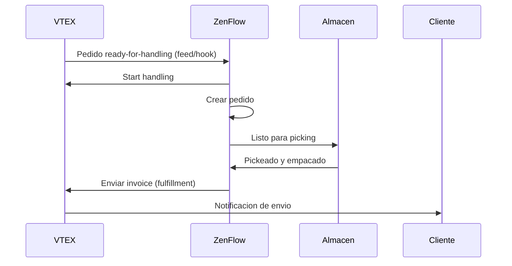

# Integracion con VTEX

Conecta tu tienda VTEX con ZenFlow para importar pedidos automaticamente, sincronizar inventario y optimizar tus operaciones de fulfillment a escala empresarial.

<Note>
  Esta integracion soporta VTEX Commerce en cualquier pais. Compatible con el OMS (Order Management System) de VTEX.
</Note>

## Caracteristicas

<CardGroup cols={2}>
  <Card title="Importar Pedidos" icon="download">
    Importa pedidos en estado "ready-for-handling"
  </Card>
  <Card title="Feed en Tiempo Real" icon="bolt">
    Recibe cambios de estado via Feed o Webhooks
  </Card>
  <Card title="Sync Inventario" icon="warehouse">
    Sincronizacion de stock por almacen hacia VTEX
  </Card>
  <Card title="Multi-almacen" icon="building">
    Soporte para multiples almacenes VTEX
  </Card>
</CardGroup>

## Guia de Configuracion

### Paso 1: Obtener Credenciales de API en VTEX

1. En tu admin de VTEX, ve a **Configuracion de la cuenta** > **Claves de aplicacion**
2. Haz clic en **Generar nueva clave**
3. Asigna los siguientes permisos:
   - OMS - Full access
   - Logistics - Full access
4. Copia el **App Key** y **App Token**

<Warning>
  El App Token solo se muestra una vez. Guardalo de forma segura.
</Warning>

### Paso 2: Conectar en ZenFlow

1. Ve a **Configuracion** > **Integraciones** en ZenFlow
2. Haz clic en **Conectar VTEX**
3. Ingresa:
   - **Account Name**: El nombre de tu cuenta VTEX (ej: `mitienda`)
   - **App Key**: La clave de aplicacion
   - **App Token**: El token de aplicacion
4. Haz clic en **Conectar**

### Paso 3: Seleccionar Almacen VTEX

Despues de conectar, selecciona el almacen de VTEX que quieres sincronizar:

1. Ve a **Integraciones** > **VTEX** > **Configuracion**
2. Selecciona el almacen VTEX de la lista
3. Habilita la sincronizacion de pedidos y/o inventario

### Paso 4: Configurar Notificaciones (Opcional)

Elige como recibir notificaciones de nuevos pedidos:

<CardGroup cols={2}>
  <Card title="Feed (Recomendado)" icon="list">
    ZenFlow consulta VTEX cada 30 segundos. Mas confiable.
  </Card>
  <Card title="Webhooks" icon="bell">
    VTEX notifica a ZenFlow en tiempo real. Mas rapido pero puede perder eventos.
  </Card>
</CardGroup>

## Flujo de Pedidos



## Referencia API

### Conectar Cuenta

```bash
POST /api/v1/integrations/vtex/connect
```

Request:
```json
{
  "account_name": "mitienda",
  "app_key": "vtexappkey-mitienda-XXXXXX",
  "app_token": "XXXXXXXXXXXXXXXXXXXXXXXXXXXXXXXX",
  "environment": "vtexcommercestable"
}
```

Respuesta:
```json
{
  "success": true,
  "data": {
    "id": "cred_abc123",
    "account_name": "mitienda",
    "status": "active",
    "connected_at": "2024-01-15T10:30:00Z"
  }
}
```

### Obtener Estado de Conexion

```bash
GET /api/v1/integrations/vtex/status
```

Respuesta:
```json
{
  "success": true,
  "data": {
    "connected": true,
    "account_name": "mitienda",
    "status": "active",
    "vtex_warehouse_id": "warehouse_1",
    "feed_configured": true,
    "hook_configured": false,
    "sync_orders": true,
    "sync_stock": true,
    "last_sync_at": "2024-01-20T15:45:00Z"
  }
}
```

### Actualizar Configuracion

```bash
PUT /api/v1/integrations/vtex/config
```

Request:
```json
{
  "sync_orders": true,
  "sync_stock": true
}
```

### Listar Almacenes VTEX

```bash
GET /api/v1/integrations/vtex/warehouses
```

Respuesta:
```json
{
  "success": true,
  "data": {
    "warehouses": [
      {
        "id": "warehouse_1",
        "name": "Deposito Central",
        "is_active": true
      },
      {
        "id": "warehouse_2",
        "name": "Sucursal Norte",
        "is_active": true
      }
    ]
  }
}
```

### Configurar Almacen

```bash
POST /api/v1/integrations/vtex/warehouses/set
```

Request:
```json
{
  "vtex_warehouse_id": "warehouse_1"
}
```

### Configurar Feed

```bash
POST /api/v1/integrations/vtex/feed/configure
```

Configura el feed de polling para recibir cambios de pedidos.

### Configurar Webhooks

```bash
POST /api/v1/integrations/vtex/hook/configure
```

Registra webhooks en VTEX para notificaciones en tiempo real.

### Sincronizar Pedidos Manualmente

```bash
POST /api/v1/integrations/vtex/sync/orders
```

Request:
```json
{
  "date_from": "2024-01-01",
  "date_to": "2024-01-31"
}
```

### Sincronizar Stock a VTEX

```bash
POST /api/v1/integrations/vtex/sync/stock
```

### Listar Mapeos de Productos

```bash
GET /api/v1/integrations/vtex/mappings
```

Respuesta:
```json
{
  "success": true,
  "data": {
    "mappings": [
      {
        "id": "map_abc123",
        "product_id": 100,
        "product_sku": "PROD-001",
        "vtex_sku_id": "123456",
        "vtex_product_id": "789",
        "sync_stock": true,
        "last_stock_sync": "2024-01-20T15:45:00Z"
      }
    ]
  }
}
```

### Crear Mapeo de Producto

```bash
POST /api/v1/integrations/vtex/mappings
```

Request:
```json
{
  "product_id": 100,
  "vtex_sku_id": "123456",
  "vtex_product_id": "789",
  "sync_stock": true
}
```

### Eliminar Mapeo

```bash
DELETE /api/v1/integrations/vtex/mappings/:id
```

### Desconectar Cuenta

```bash
POST /api/v1/integrations/vtex/disconnect
```

## Notificaciones de Pedidos

### Feed (Polling)

El feed es el metodo recomendado para recibir notificaciones:

- ZenFlow consulta VTEX cada 30 segundos
- Procesa cambios de estado en lote
- Confirma items procesados para evitar duplicados
- Mas confiable que webhooks (no pierde eventos)

### Webhooks

Los webhooks proporcionan notificaciones en tiempo real:

| Evento | Descripcion | Accion en ZenFlow |
|--------|-------------|-------------------|
| Estado cambia a `ready-for-handling` | Pedido listo | Importa y inicia handling |
| Estado cambia a `handling` | En preparacion | Actualiza estado |
| Estado cambia a `invoiced` | Enviado | Marca como completado |
| Estado cambia a `canceled` | Cancelado | Cancela pedido |

## Mapeo de Productos

### Coincidencia Automatica

Cuando se importa un pedido, ZenFlow intenta coincidir productos automaticamente:

1. Busca mapeo existente por `vtex_sku_id`
2. Si no existe, busca por **SKU** o **codigo de barras** en ZenFlow
3. Si encuentra, crea el mapeo automaticamente

### Mapeo Manual

Para productos que no coinciden automaticamente:

1. Ve a **Integraciones** > **VTEX** > **Mapeo de Productos**
2. Filtra por "Sin mapear"
3. Selecciona el producto ZenFlow correspondiente

## Mapeo de Estados

| Estado VTEX | Estado ZenFlow |
|-------------|----------------|
| `order-created` | Pendiente |
| `payment-approved` | Listo para preparar |
| `ready-for-handling` | Listo para preparar |
| `start-handling` | En progreso |
| `handling` | En progreso |
| `invoice` | Listo para despacho |
| `invoiced` | Enviado |
| `canceled` | Cancelado |

## Sincronizacion de Inventario

La sincronizacion de stock funciona de la siguiente manera:

1. ZenFlow calcula el stock disponible (total - reservado)
2. Actualiza el inventario en VTEX para el almacen configurado
3. Solo sincroniza productos con mapeo activo y `sync_stock: true`

```json
// Ejemplo de actualizacion
PUT /api/logistics/pvt/inventory/skus/{sku}/warehouses/{warehouse}
{
  "quantity": 50,
  "unlimitedQuantity": false
}
```

## Solucion de Problemas

### No Puedo Conectar

<Accordion title="Verificar credenciales">
  Asegurate de que el App Key y App Token sean correctos. Genera nuevas credenciales si es necesario.
</Accordion>

<Accordion title="Verificar permisos">
  Las credenciales necesitan acceso completo a OMS y Logistics. Verifica los permisos en VTEX Admin.
</Accordion>

<Accordion title="Verificar nombre de cuenta">
  El account_name debe ser exactamente el nombre de tu cuenta VTEX (sin ".vtexcommercestable.com.br").
</Accordion>

### Pedidos No Se Importan

<Accordion title="Verificar estado del pedido">
  Solo se importan pedidos en estado "ready-for-handling". Verifica el flujo de pedidos en VTEX.
</Accordion>

<Accordion title="Verificar almacen configurado">
  Asegurate de haber seleccionado el almacen VTEX correcto en la configuracion.
</Accordion>

<Accordion title="Verificar feed o webhooks">
  Verifica que el feed este configurado (recomendado) o que los webhooks esten activos.
</Accordion>

### Stock No Se Sincroniza

<Accordion title="Verificar mapeo de producto">
  El producto debe estar mapeado y tener `sync_stock` habilitado.
</Accordion>

<Accordion title="Verificar almacen VTEX">
  El almacen VTEX debe estar configurado en la integracion.
</Accordion>

<Accordion title="Verificar permisos de Logistics">
  Las credenciales necesitan permisos de Logistics para actualizar inventario.
</Accordion>

## Limites de Tasa

| Operacion | Limite |
|-----------|--------|
| Llamadas API | 100 requests/segundo |
| Maximo por minuto | 6000 requests |

ZenFlow maneja los limites de tasa automaticamente con espera y reintentos.

## Requisitos

- Cuenta VTEX activa
- App Key y App Token con permisos:
  - OMS - Full access
  - Logistics - Full access
- Al menos un almacen configurado en VTEX

## Soporte

- [Documentacion de VTEX APIs](https://developers.vtex.com/docs/api-reference)
- [VTEX Help Center](https://help.vtex.com/)
- Contacta a [support@zenflow.com](mailto:support@zenflow.com) para ayuda con la integracion
