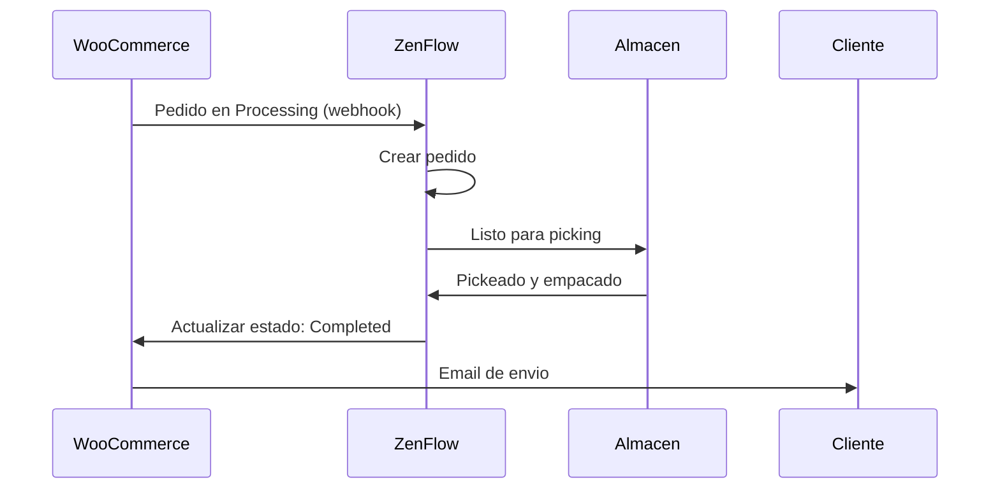

# Integracion con WooCommerce

Conecta tu tienda WooCommerce con ZenFlow para importar pedidos automaticamente, sincronizar inventario y optimizar tus operaciones de fulfillment.

<Note>
  Esta integracion soporta WooCommerce 3.5+ con WordPress. Compatible con productos simples y variables.
</Note>

## Caracteristicas

<CardGroup cols={2}>
  <Card title="Importar Pedidos" icon="download">
    Importa automaticamente pedidos en procesamiento
  </Card>
  <Card title="Actualizar Estados" icon="rotate">
    Sincroniza estados de pedidos bidirecccionalmente
  </Card>
  <Card title="Sync Inventario" icon="warehouse">
    Sincronizacion de stock en tiempo real hacia WooCommerce
  </Card>
  <Card title="Productos Variables" icon="barcode">
    Soporte completo para productos con variaciones
  </Card>
</CardGroup>

## Guia de Configuracion

### Paso 1: Generar Credenciales API en WooCommerce

1. En tu panel de WordPress, ve a **WooCommerce** > **Ajustes** > **Avanzado** > **REST API**
2. Haz clic en **Agregar clave**
3. Configura:
   - **Descripcion**: ZenFlow Integration
   - **Usuario**: Selecciona un administrador
   - **Permisos**: Lectura/Escritura
4. Haz clic en **Generar clave API**
5. **Guarda** la Consumer Key y Consumer Secret (no se mostraran nuevamente)

<Warning>
  Asegurate de copiar las credenciales inmediatamente. WooCommerce solo las muestra una vez.
</Warning>

### Paso 2: Conectar en ZenFlow

1. Ve a **Configuracion** > **Integraciones** en ZenFlow
2. Haz clic en **Conectar WooCommerce**
3. Ingresa:
   - URL de tu tienda (ej: `https://mitienda.com`)
   - Consumer Key
   - Consumer Secret
4. Haz clic en **Conectar**

### Paso 3: Configurar Sincronizacion

Despues de conectar, establece tus preferencias:

```
Configuracion de Pedidos:
- Sincronizar pedidos: Si/No
- Estados a importar: Processing
- Almacen por defecto: [Seleccionar]

Configuracion de Inventario:
- Sincronizar stock: Si/No
- Direccion: ZenFlow -> WooCommerce
```

## Flujo de Pedidos



## Referencia API

### Conectar Tienda

```bash
POST /api/v1/integrations/woocommerce/connect
```

Request:
```json
{
  "store_url": "https://mitienda.com",
  "consumer_key": "ck_xxxxxxxxxxxxxxxxxxxxxxxxxxxxxxxxxxxxxxxx",
  "consumer_secret": "cs_xxxxxxxxxxxxxxxxxxxxxxxxxxxxxxxxxxxxxxxx",
  "warehouse_id": 1
}
```

Respuesta:
```json
{
  "success": true,
  "data": {
    "id": "cred_abc123",
    "store_url": "https://mitienda.com",
    "store_name": "Mi Tienda",
    "status": "active",
    "connected_at": "2024-01-15T10:30:00Z"
  }
}
```

### Obtener Estado de Conexion

```bash
GET /api/v1/integrations/woocommerce/status
```

Respuesta:
```json
{
  "success": true,
  "data": {
    "connected": true,
    "store_url": "https://mitienda.com",
    "store_name": "Mi Tienda",
    "status": "active",
    "sync_orders": true,
    "sync_stock": true,
    "last_sync_at": "2024-01-20T15:45:00Z"
  }
}
```

### Actualizar Configuracion

```bash
PUT /api/v1/integrations/woocommerce/config
```

Request:
```json
{
  "sync_orders": true,
  "sync_stock": true
}
```

### Sincronizar Pedidos Manualmente

```bash
POST /api/v1/integrations/woocommerce/sync/orders
```

Request:
```json
{
  "date_from": "2024-01-01",
  "date_to": "2024-01-31"
}
```

### Sincronizar Stock a WooCommerce

```bash
POST /api/v1/integrations/woocommerce/sync/stock
```

Sincroniza todos los niveles de inventario de productos mapeados hacia WooCommerce.

### Listar Mapeos de Productos

```bash
GET /api/v1/integrations/woocommerce/mappings
```

Respuesta:
```json
{
  "success": true,
  "data": {
    "mappings": [
      {
        "id": "map_abc123",
        "product_id": 100,
        "product_sku": "PROD-001",
        "wc_product_id": 456,
        "wc_variation_id": null,
        "wc_sku": "PROD-001",
        "sync_stock": true,
        "last_stock_sync": "2024-01-20T15:45:00Z"
      }
    ]
  }
}
```

### Crear Mapeo de Producto

```bash
POST /api/v1/integrations/woocommerce/mappings
```

Request:
```json
{
  "product_id": 100,
  "wc_product_id": 456,
  "wc_variation_id": null,
  "sync_stock": true
}
```

### Eliminar Mapeo

```bash
DELETE /api/v1/integrations/woocommerce/mappings/:id
```

### Desconectar Tienda

```bash
POST /api/v1/integrations/woocommerce/disconnect
```

## Eventos Webhook

ZenFlow recibe estos webhooks de WooCommerce automaticamente:

| Topic | Descripcion | Accion en ZenFlow |
|-------|-------------|-------------------|
| `order.created` | Nuevo pedido creado | Importa si esta en "processing" |
| `order.updated` | Pedido actualizado | Actualiza estado en ZenFlow |
| `order.deleted` | Pedido eliminado | Marca como cancelado |

<Note>
  Los webhooks se registran automaticamente en WooCommerce cuando conectas tu tienda.
</Note>

## Mapeo de Productos

### Coincidencia Automatica

Cuando se importa un pedido, ZenFlow intenta coincidir productos automaticamente:

1. Busca mapeo existente por `wc_product_id` + `wc_variation_id`
2. Si no existe, busca por **SKU** en el catalogo de ZenFlow
3. Si encuentra por SKU, crea el mapeo automaticamente

### Mapeo Manual

Para productos que no coinciden automaticamente:

1. Ve a **Integraciones** > **WooCommerce** > **Mapeo de Productos**
2. Filtra por "Sin mapear"
3. Selecciona el producto ZenFlow correspondiente

### Productos Variables

Cada variacion de WooCommerce se mapea a un producto separado en ZenFlow:

| WooCommerce | ZenFlow |
|-------------|---------|
| Remera (Talle: S, Color: Azul) | REMERA-S-AZUL |
| Remera (Talle: M, Color: Azul) | REMERA-M-AZUL |
| Remera (Talle: L, Color: Azul) | REMERA-L-AZUL |

## Mapeo de Estados

| Estado WooCommerce | Estado ZenFlow |
|--------------------|----------------|
| `pending` | Pendiente |
| `processing` | Listo para preparar |
| `on-hold` | Pendiente |
| `completed` | Completado |
| `cancelled` | Cancelado |
| `refunded` | Cancelado |
| `failed` | Cancelado |

## Solucion de Problemas

### No Puedo Conectar

<Accordion title="Verificar URL de la tienda">
  Asegurate de usar la URL correcta incluyendo `https://`. La URL debe ser accesible publicamente.
</Accordion>

<Accordion title="Verificar credenciales API">
  Las Consumer Key y Secret deben tener permisos de Lectura/Escritura. Genera nuevas credenciales si es necesario.
</Accordion>

<Accordion title="Verificar SSL">
  WooCommerce requiere HTTPS para la API REST. Asegurate de que tu sitio tenga un certificado SSL valido.
</Accordion>

### Pedidos No Se Importan

<Accordion title="Verificar estado del pedido">
  Por defecto, solo se importan pedidos en estado "Processing". Los pedidos en "Pending" o "On-hold" no se importan automaticamente.
</Accordion>

<Accordion title="Verificar webhooks">
  Ve a **WooCommerce** > **Ajustes** > **Avanzado** > **Webhooks** y verifica que los webhooks de ZenFlow esten activos.
</Accordion>

<Accordion title="Verificar configuracion de sync">
  Asegurate de que `sync_orders` este habilitado en la configuracion de la integracion.
</Accordion>

### Stock No Se Sincroniza

<Accordion title="Verificar mapeo de producto">
  El producto debe estar mapeado correctamente. Verifica que exista un mapeo en **Mapeo de Productos**.
</Accordion>

<Accordion title="Verificar flag de sync">
  Cada mapeo tiene un flag `sync_stock`. Asegurate de que este habilitado.
</Accordion>

<Accordion title="Verificar gestion de stock en WC">
  En WooCommerce, el producto debe tener habilitada la opcion "Gestionar stock" para que ZenFlow pueda actualizar las cantidades.
</Accordion>

## Limites de Tasa

| Operacion | Limite |
|-----------|--------|
| Llamadas API | 5 requests/segundo |
| Timeout | 30 segundos |

ZenFlow maneja los limites de tasa automaticamente con reintentos y backoff exponencial.

## Requisitos

- WooCommerce 3.5 o superior
- WordPress 5.0 o superior
- HTTPS habilitado (certificado SSL)
- API REST de WooCommerce habilitada
- Permalinks configurados (no usar "Simple")

## Soporte

- [Documentacion de WooCommerce REST API](https://woocommerce.github.io/woocommerce-rest-api-docs/)
- Contacta a [support@zenflow.com](mailto:support@zenflow.com) para ayuda con la integracion
