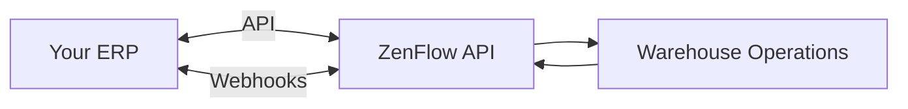
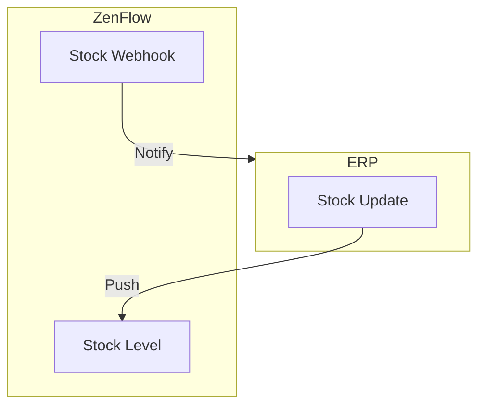

# ERP Integration Guide

This guide covers best practices for integrating ZenFlow with your Enterprise Resource Planning (ERP) system for seamless order fulfillment and inventory synchronization.

## Integration Architecture



## Key Integration Points

<CardGroup cols={2}>
  <Card title="Orders" icon="box" href="#order-sync">
    Push orders from ERP to ZenFlow for fulfillment
  </Card>
  <Card title="Products" icon="barcode" href="#product-sync">
    Sync product catalog between systems
  </Card>
  <Card title="Stock" icon="warehouse" href="#stock-sync">
    Bidirectional inventory synchronization
  </Card>
  <Card title="Events" icon="bell" href="#webhooks">
    Receive fulfillment status updates
  </Card>
</CardGroup>

## Order Sync

### Pushing Orders to ZenFlow

When a new order is created in your ERP, push it to ZenFlow:

```javascript
async function syncOrderToZenflow(erpOrder) {
  const zenflowOrder = {
    order_tenant_id: erpOrder.orderNumber,  // Your unique order ID
    assembly_date: erpOrder.shipByDate,
    customer_name: erpOrder.customerName,
    shipping_address: erpOrder.shippingAddress,
    order_detail: erpOrder.items.map(item => ({
      barcode: item.sku,
      quantity: item.quantity,
      price: item.unitPrice
    }))
  };

  const response = await fetch('https://api.zenflow.com/api/v1/orders', {
    method: 'POST',
    headers: {
      'X-API-Key': ZENFLOW_API_KEY,
      'Content-Type': 'application/json'
    },
    body: JSON.stringify(zenflowOrder)
  });

  const result = await response.json();

  if (result.success) {
    // Store ZenFlow order ID for reference
    await saveMapping(erpOrder.id, result.data.orders[0].id);
  }

  return result;
}
```

### Handling Order Status Updates

Set up a webhook to receive status updates:

```javascript
app.post('/webhooks/zenflow', (req, res) => {
  res.status(200).send('OK');

  const event = req.body;

  switch (event.event) {
    case 'order.updated':
      updateOrderStatusInERP(event.data.order_tenant_id, event.data.state_name);
      break;

    case 'order.completed':
      markOrderAsShippedInERP(event.data.order_tenant_id, {
        completedAt: event.data.updated_at,
        trackingNumber: event.data.tracking_number
      });
      break;

    case 'order.cancelled':
      handleOrderCancellation(event.data.order_tenant_id);
      break;
  }
});
```

### Order State Mapping

Map ZenFlow states to your ERP states:

| ZenFlow State | Typical ERP State |
|---------------|-------------------|
| Pending | Awaiting Fulfillment |
| In Progress | Picking |
| Packed | Ready to Ship |
| Completed | Shipped |
| Cancelled | Cancelled |

## Product Sync

### Initial Catalog Import

Sync your product catalog to ZenFlow:

```javascript
async function syncCatalog(products) {
  // Use bulk endpoint for efficiency
  const response = await fetch('https://api.zenflow.com/api/v1/products/bulk', {
    method: 'POST',
    headers: {
      'X-API-Key': ZENFLOW_API_KEY,
      'Content-Type': 'application/json'
    },
    body: JSON.stringify({
      products: products.map(p => ({
        barcode: p.barcode,
        sku: p.sku,
        name: p.name,
        category: p.category,
        weight: p.weight,
        price: p.price
      }))
    })
  });

  return response.json();
}
```

### Incremental Updates

For product changes, sync incrementally:

```javascript
async function onProductUpdated(product) {
  const zenflowProduct = await findZenflowProductBySku(product.sku);

  if (zenflowProduct) {
    // Update existing
    await updateProduct(zenflowProduct.id, product);
  } else {
    // Create new
    await createProduct(product);
  }
}
```

## Stock Sync

### Bidirectional Sync Strategy



### Pushing Stock to ZenFlow

When stock changes in your ERP:

```javascript
async function syncStockToZenflow(productSku, locationId, quantity) {
  const response = await fetch(
    `https://api.zenflow.com/api/v1/stock/product/${productId}`,
    {
      method: 'PUT',
      headers: {
        'X-API-Key': ZENFLOW_API_KEY,
        'Content-Type': 'application/json'
      },
      body: JSON.stringify({
        location_id: locationId,
        quantity: quantity,
        reason: 'ERP stock sync'
      })
    }
  );

  return response.json();
}
```

### Receiving Stock Updates

Handle stock webhooks from ZenFlow:

```javascript
app.post('/webhooks/zenflow', (req, res) => {
  res.status(200).send('OK');

  if (req.body.event === 'stock.updated') {
    const { product_barcode, quantity, previous_quantity } = req.body.data;

    // Update ERP only if ZenFlow is source of truth
    if (ZENFLOW_IS_STOCK_SOURCE) {
      updateERPStock(product_barcode, quantity);
    }
  }
});
```

### Bulk Stock Sync

For periodic full sync:

```javascript
async function fullStockSync() {
  // Get all stock from ERP
  const erpStock = await getERPStockLevels();

  // Bulk update ZenFlow
  const response = await fetch('https://api.zenflow.com/api/v1/stock/bulk', {
    method: 'POST',
    headers: {
      'X-API-Key': ZENFLOW_API_KEY,
      'Content-Type': 'application/json'
    },
    body: JSON.stringify({
      updates: erpStock.map(item => ({
        sku: item.sku,
        location_id: item.locationId,
        quantity: item.quantity
      }))
    })
  });

  const result = await response.json();
  console.log(`Synced ${result.data.success} items`);
}
```

## Best Practices

### 1. Use Idempotency Keys

Always use your ERP's order ID as `order_tenant_id`:

```javascript
// This prevents duplicate orders
const order = {
  order_tenant_id: erpOrder.id,  // Your unique ID
  // ...
};
```

### 2. Handle Network Failures

Implement retry logic with queuing:

```javascript
const queue = new PQueue({ concurrency: 5 });

async function syncOrderWithRetry(order) {
  return queue.add(async () => {
    for (let attempt = 0; attempt < 3; attempt++) {
      try {
        return await syncOrderToZenflow(order);
      } catch (error) {
        if (attempt === 2) throw error;
        await delay(Math.pow(2, attempt) * 1000);
      }
    }
  });
}
```

### 3. Maintain ID Mappings

Keep a mapping table between ERP and ZenFlow IDs:

```sql
CREATE TABLE erp_zenflow_mapping (
  erp_id VARCHAR(50) PRIMARY KEY,
  zenflow_id INTEGER NOT NULL,
  entity_type VARCHAR(20) NOT NULL,
  synced_at TIMESTAMP DEFAULT NOW()
);
```

### 4. Implement Webhooks

Don't poll - use webhooks for real-time updates:

```javascript
// Subscribe to relevant events
await createWebhook({
  name: 'ERP Sync',
  url: 'https://your-erp.com/webhooks/zenflow',
  events: [
    'order.updated',
    'order.completed',
    'stock.updated'
  ]
});
```

### 5. Monitor Integration Health

Track sync metrics:

```javascript
const metrics = {
  ordersSynced: 0,
  ordersFaile: 0,
  stockUpdates: 0,
  lastSyncTime: null
};

// Log metrics periodically
setInterval(() => {
  console.log('Integration metrics:', metrics);
}, 60000);
```

## Common Patterns

### Scheduled Sync

For non-critical data, use scheduled syncs:

```javascript
// Run every 15 minutes
cron.schedule('*/15 * * * *', async () => {
  await syncPendingOrders();
  await syncStockLevels();
});
```

### Event-Driven Sync

For critical data, use events:

```javascript
// ERP emits event when order created
erpEvents.on('order.created', async (order) => {
  await syncOrderToZenflow(order);
});
```

## Need Help?

- Review [API Reference](/api-reference/overview) for endpoint details
- Check [Webhooks Guide](/guides/webhooks) for event setup
- Contact [support@zenflow.com](mailto:support@zenflow.com) for integration assistance
