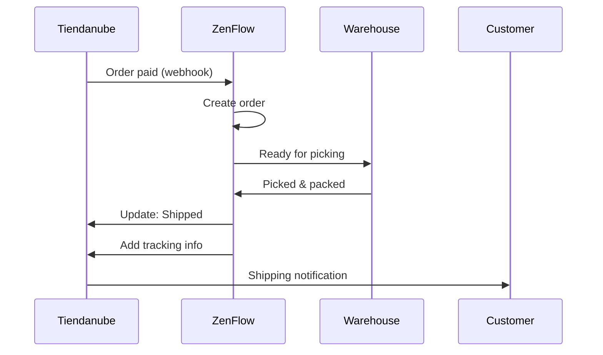

# Tiendanube Integration

Connect your Tiendanube store with ZenFlow to automatically import orders, sync inventory, and streamline your fulfillment operations.

<Note>
  This integration supports Tiendanube stores in Argentina, Brazil, Mexico, Colombia, and Chile.
</Note>

## Features

<CardGroup cols={2}>
  <Card title="Order Import" icon="download">
    Automatically import paid orders from Tiendanube
  </Card>
  <Card title="Status Updates" icon="rotate">
    Update order and shipping status in your store
  </Card>
  <Card title="Inventory Sync" icon="warehouse">
    Real-time stock synchronization
  </Card>
  <Card title="Product Sync" icon="barcode">
    Import and sync your product catalog
  </Card>
</CardGroup>

## Setup Guide

### Step 1: Connect Your Store

1. Go to **Settings** > **Integrations** in ZenFlow
2. Click **Connect Tiendanube**
3. Enter your Tiendanube store URL (e.g., `mystore.tiendanube.com`)
4. Log in and authorize ZenFlow

### Step 2: Configure Import Settings

After connecting, set your preferences:

```
Order Settings:
- Import orders: Paid orders only / All orders
- Default warehouse: [Select]
- Auto-assign picking flow: Yes/No

Product Settings:
- Sync products: Yes/No
- Match by: SKU / Barcode / Name
- Create missing products: Yes/No

Inventory Settings:
- Sync direction: ZenFlow -> Tiendanube / Bidirectional
- Sync frequency: Real-time / Every 15 min / Hourly
```

### Step 3: Initial Sync

Click **Sync Now** to perform an initial synchronization:
1. Import existing products
2. Import pending orders
3. Sync current inventory levels

## Order Flow



## API Reference

### Get Store Connection

```bash
GET /api/v1/integrations/tiendanube/stores
```

Response:
```json
{
  "success": true,
  "data": {
    "stores": [
      {
        "id": "1234567",
        "name": "Mi Tienda",
        "url": "mitienda.tiendanube.com",
        "country": "AR",
        "connected_at": "2024-01-15T10:30:00Z",
        "status": "active",
        "last_sync": "2024-01-20T15:45:00Z"
      }
    ]
  }
}
```

### Sync Orders

```bash
POST /api/v1/integrations/tiendanube/sync/orders
```

Request:
```json
{
  "store_id": "1234567",
  "date_from": "2024-01-01",
  "status": ["paid", "packed"]
}
```

### Sync Products

```bash
POST /api/v1/integrations/tiendanube/sync/products
```

Request:
```json
{
  "store_id": "1234567",
  "create_missing": true,
  "update_existing": true
}
```

### Update Inventory

```bash
POST /api/v1/integrations/tiendanube/inventory/update
```

Request:
```json
{
  "store_id": "1234567",
  "products": [
    {
      "sku": "PROD-001",
      "stock": 100
    },
    {
      "sku": "PROD-002",
      "stock": 50
    }
  ]
}
```

## Webhook Events

ZenFlow receives these events from Tiendanube:

| Event | Description |
|-------|-------------|
| `order/created` | New order placed |
| `order/paid` | Order payment confirmed |
| `order/fulfilled` | Order marked as shipped |
| `order/cancelled` | Order cancelled |
| `product/created` | New product added |
| `product/updated` | Product details changed |

## Product Mapping

### Automatic Matching

ZenFlow tries to match products automatically using:
1. SKU (exact match)
2. Barcode / EAN
3. Product name (fuzzy match)

### Manual Mapping

For products that can't be matched automatically:

1. Go to **Integrations** > **Tiendanube** > **Product Mapping**
2. View unmatched products
3. Select the corresponding ZenFlow product for each

```json
{
  "mappings": [
    {
      "tiendanube_product_id": "12345",
      "tiendanube_variant_id": "67890",
      "zenflow_product_id": 100,
      "zenflow_sku": "PROD-001"
    }
  ]
}
```

## Multi-variant Products

For products with variants (size, color, etc.):

- Each variant maps to a separate ZenFlow product
- Stock is tracked per variant
- Orders include variant-specific details

Example mapping:
| Tiendanube | ZenFlow |
|------------|---------|
| T-Shirt (S) | TSHIRT-S |
| T-Shirt (M) | TSHIRT-M |
| T-Shirt (L) | TSHIRT-L |

## Troubleshooting

### Orders Not Syncing

<Accordion title="Verify webhook configuration">
  Check that Tiendanube webhooks are properly configured. Go to your Tiendanube admin panel > Apps > ZenFlow to verify the connection.
</Accordion>

<Accordion title="Check order status filter">
  By default, only "paid" orders are imported. Adjust your settings if you need to import orders in other states.
</Accordion>

### Inventory Mismatch

<Accordion title="Check sync direction">
  Verify your sync direction setting. If set to "ZenFlow -> Tiendanube", changes in Tiendanube won't update ZenFlow.
</Accordion>

<Accordion title="Force full sync">
  Use the "Full Sync" option to reconcile all inventory levels.
</Accordion>

### Product Not Found

<Accordion title="Check SKU matching">
  Ensure the product SKU in Tiendanube matches exactly with ZenFlow (case-sensitive).
</Accordion>

<Accordion title="Enable auto-create">
  Enable "Create missing products" to automatically add new products from Tiendanube.
</Accordion>

## Rate Limits

| Operation | Limit |
|-----------|-------|
| API calls | 2 requests/second |
| Bulk operations | 100 items/request |

ZenFlow handles rate limiting automatically with exponential backoff.

## Support

- [Tiendanube Developer Documentation](https://tiendanube.github.io/api-documentation)
- Contact [support@zenflow.com](mailto:support@zenflow.com) for integration help
